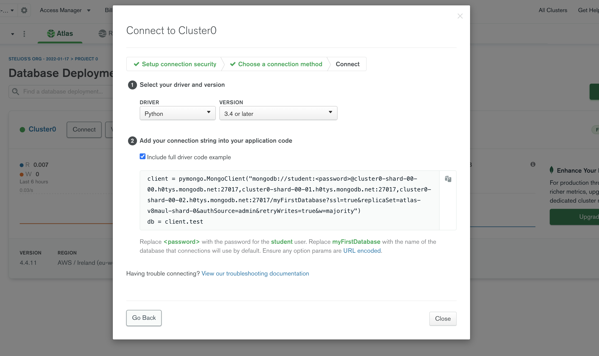

### Lab2.3: **MongoDB and Python**


#### What am I about to learn?

In this lab session, you will explore the use of MongoDB to extract data.

Lab 2 part 3 focuses on how to:

* Run MongoDB with Python to **C**reate, **R**ead, **U**pdate and **D**elete data, also known as CRUD operations.

####  Do you want to explore more on MongoDB?

Check out the [MongoDB: The Definitive Guide, 3rd Edition](https://www.oreilly.com/library/view/mongodb-the-definitive/9781491954454/) in Learning O'Reilly online.

[Link to Birkbeck O'Reilly digital library](https://go.oreilly.com/Birkbeck) - you will need to have a Birkbeck email address if you wish to access this resource.

#### Lab 2.3: CRUD on MongoDB 

This is extra material for you to explore on how to use Python to interact with MongoDB.


1.  Let's create a new connection to the MongoDB server. Before we start, we will need to install the `pymongo` library.

> Run the following command to install `pymongo` inside Jupyter notebook or Google Colab.


``` python
!python3 -m pip install pymongo
```

> You can use the next command to install it in your personal computer.
>
> ```
> pip3 install pymongo
> ```

2. Visit MongoDB atlas and create a MongoDB driver for `Python 3.4 or later`. Update the next script with your own driver.

> The next screenshot shows my connector.
>
> 


``` python
from pymongo import MongoClient

# You need to replace the next connection string with your own database driver

server = 'mongodb://<user>:<password>@cluster0-shard-00-00.h0tys.mongodb.net:27017,cluster0-shard-00-01.h0tys.mongodb.net:27017,cluster0-shard-00-02.h0tys.mongodb.net:27017/myFirstDatabase?ssl=true&replicaSet=atlas-v8maul-shard-0&authSource=admin&retryWrites=true&w=majority'

conn = MongoClient(server)
```

3. Let's extract the films that we created in the previous lab. Firstly, we need to connect to `MiniFilms.films` collection, so let's create a new `col_films` variable for this.


``` python
col_films = conn.MiniFilms.films
```

4. Let's use the `col_films` to select a record of our data using the `find_one` method.


``` python
print(col_films.find_one())
```


```javascript
{'_id': ObjectId('61e58433542e1cdb1fd4384a'), 'film_name': 'Umbrella', 'film_type': 'Animated Short Film', 'film_year': '2021', 'film_link': 'https://youtu.be/Bl1FOKpFY2Q'}
```

> Note that we can use the same, `find_one` method in Node.js as in Python. Check this [short tutorial on Mongoose | findOne() Function](https://www.geeksforgeeks.org/mongoose-findone-function/).

5. Let's try the pretty print `pprint`, it's a good idea to use `pprint` each time we have long JSON documents.


``` python
 from pprint import pprint
 pprint(col_films.find_one())
```


```javascript
{'_id': ObjectId('61e58433542e1cdb1fd4384a'),
 'film_link': 'https://youtu.be/Bl1FOKpFY2Q',
 'film_name': 'Umbrella',
 'film_type': 'Animated Short Film',
 'film_year': '2021'}
```

6. Let's connect to the `MiniFilms` database, but in this case, we will create a new collection called `users` to host the users of the MiniFilm app.


``` python
col_users = conn.MiniFilms.users
```

7. Let's insert some data! Make sure you run the next command and then go to your MongoDB collection. The new `users` collection should be there along with the `films`. The output is just a `Record added` message.


``` python
user1 = {
		"user_name":"Tom Jones",
		"user_age":44,
		"user_location":"London"
		}

col_users.insert_one(user1)
print("Record added")
```


    Record added

8. Let's print our new user, since we have just one user we can use the `find_one` method.


``` python
pprint(col_users.find_one())
```


```javascript
{'_id': ObjectId('61e6bb9530052a285f182647'),
 'user_age': 44,
 'user_location': 'London',
 'user_name': 'Tom Jones'}
```

9. We can add multiple records using the following script.


``` python
user2 = {
		"user_name":"Jane Williams",
		"user_age":50,
		"user_location":"London"
		}

user3 = {
		"user_name":"Kate Johnson",
		"user_age":35,
		"user_location":"Brighton"
		}

col_users.insert_many([user2, user3])
```


    <pymongo.results.InsertManyResult at 0x7f6c11bf2c80>

10. We can use the `find_one()` method to extract the first record. We can also extract specific fields from this record as follows.


``` python
col_users.find_one({},{"user_name": 1, "user_location":1})
```


```javascript
{'_id': ObjectId('61e6bb9530052a285f182647'),
 'user_location': 'London',
 'user_name': 'Tom Jones'}
```

>  As you can see, the "\_id" is returned by default. To avoid this, you can add "\_id": 0 to your request.

11. We can also extract data using a `for` loop as follows.


``` python
for record in col_users.find():
  print(record)
```


```javascript
{'_id': ObjectId('61e6bb9530052a285f182647'), 'user_name': 'Tom Jones', 'user_age': 44, 'user_location': 'London'}
{'_id': ObjectId('61e6bc6830052a285f18264a'), 'user_name': 'Jane Williams', 'user_age': 50, 'user_location': 'London'}
{'_id': ObjectId('61e6bc6830052a285f18264b'), 'user_name': 'Kate Johnson', 'user_age': 35, 'user_location': 'Brighton'}
```

12. Let's sort the results:

>  Sort users by age in descending order.


``` python
results = col_users.find().sort("user_age", -1)
for user in results:
  print(user)
```


```javascript
{'_id': ObjectId('61e6bc6830052a285f18264a'), 'user_name': 'Jane Williams', 'user_age': 50, 'user_location': 'London'}
{'_id': ObjectId('61e6bb9530052a285f182647'), 'user_name': 'Tom Jones', 'user_age': 44, 'user_location': 'London'}
{'_id': ObjectId('61e6bc6830052a285f18264b'), 'user_name': 'Kate Johnson', 'user_age': 35, 'user_location': 'Brighton'}
```

13. Let's extract the "oldest" user, in this case we just need to use the `limit` method.


``` python
doc = col_users.find().sort("user_age", -1).limit(1)

print(doc[0])
```


```javascript
{'_id': ObjectId('61e6bc6830052a285f18264a'), 'user_name': 'Jane Williams', 'user_age': 50, 'user_location': 'London'}
```

14. Let's run the following query:

> Search for users older than 45.


``` python
results = col_users.find({"user_age": {"$gt":45}},{})
for user in results:
  print(user)
```


```javascript
{'_id': ObjectId('61e6bc6830052a285f18264a'), 'user_name': 'Jane Williams', 'user_age': 50, 'user_location': 'London'}
```

15. Let's customise our query:

> Select `user_name`, `user_age` and `user_location` for users older than 45. 


``` python
results = col_users.find({"user_age": {"$gt":45}},{"_id": 0, "user_name": 1, "user_age": 1, "user_location":1})
for user in results:
  print(user)
```


```javascript
{'user_name': 'Jane Williams', 'user_age': 50, 'user_location': 'London'}
```

16. Let's extract the users from London. For this query let's print`user_name` and `user_location`.


``` python
res = col_users.find({"user_location": {"$eq":"London"}},{"_id": 0,"user_name": 1, "user_location":1})
for record in res:
  print(record)
```


```javascript
{'user_location': 'London', 'user_name': 'Tom Jones'}
{'user_location': 'London', 'user_name': 'Jane Williams'}
```

17. Let's create an aggregation to group data by `user_location`. For this, I created a new column called `num_instances` to group data by `user_location` counts.


``` python
agg_result= col_users.aggregate(
    [{
    "$group" : 
        {"_id" : "$user_location", 
         "num_instances" : {"$sum" : 1}
         }}
    ])

for record in agg_result:
  print(record)
```


```javascript
{'_id': 'London', 'num_instances': 2}
{'_id': 'Brighton', 'num_instances': 1}
```

18. Let's create a pipeline to aggregate data, our first pipeline has two steps:

> Step 1: Select users from `London`
> 
> Step 2: Then, sort the data in ascending order

Finally, we can print the results using a `for` loop.

> An aggregation pipeline consists **of one or more stages that process documents**. For example, a stage can filter documents, group documents, and calculate values.


``` python
import pymongo
pipeline = [
{
	      "$match": {
	         "user_location": "London"
	      }
	   },
	   {
	      "$sort": {
	         "user_age": pymongo.ASCENDING
	      }
	   },
	]
results = col_users.aggregate(pipeline)

for record in results:
  print(record)
```


```javascript
{'_id': ObjectId('61e6bb9530052a285f182647'), 'user_name': 'Tom Jones', 'user_age': 44, 'user_location': 'London'}
{'_id': ObjectId('61e6bc6830052a285f18264a'), 'user_name': 'Jane Williams', 'user_age': 50, 'user_location': 'London'}
```

19. Now, let's create a second aggregation pipeline, this one has the next three steps:

> Step 1: Select users from `London`
> 
> Step 2: Sort the data in descending order
> 
> Step 3: Limit the data to extract top record

In other words, this query **selects the oldest user from London**. 😃


``` python
stage_match_location = {
	   "$match": {
	         "user_location": "London"
	   }
	}

stage_sort_age_descending = {
	   "$sort": { "user_age": pymongo.DESCENDING }
	}

stage_limit_1 = { "$limit": 1 }
	
pipeline = [
	   stage_match_location,
	   stage_sort_age_descending,
	   stage_limit_1,
	]

results = col_users.aggregate(pipeline)

for record in results:
  print(record)
```


```javascript
{'_id': ObjectId('61e6bc6830052a285f18264a'), 'user_name': 'Jane Williams', 'user_age': 50, 'user_location': 'London'}
```

20. Let's try something new , we will insert a new user and then we will associate the new user with a new film. Let's add the new user (`user4`) called `Dan Berry` from `London`.


``` python
user4 = {
		"user_name":"Dan Berry",
		"user_age":64,
		"user_location":"London"
		}

col_users.insert_one(user4)
```


    <pymongo.results.InsertOneResult at 0x7f6c0dae4dc0>

21. `Dan` is now stored in our `users` collection. Let's extract `Dan`'s id.


``` python
res = col_users.find_one({"user_name": {"$eq":"Dan Berry"}})
print(res)
```


```javascript
{'_id': ObjectId('61e6c0ca30052a285f18264c'), 'user_name': 'Dan Berry', 'user_age': 64, 'user_location': 'London'}
```

22. Let's insert a new short film called `WiNDUP`. Let's assume that `WiNDUP` is Dan's favourite film! This means we will need to create a new relationship between `Dan` and `WiNDUP`.

> We will use `Dan`'s `_id` to create the link between the two records.


``` python
from bson.objectid import ObjectId

# The _id of Dan to use it as a reference 
# user_id is '61e6c0ca30052a285f18264c'

user_id = res["_id"]

film1 = {
		"film_name=":"WinDUP",
		"film_type":"Animated Short Film",
		"film_year":"2021",
    "film_link":"https://youtu.be/efGqe1j3RNk",
    "film_user_id":ObjectId(user_id)
		}

conn.MiniFilms.films.insert_one(film1)
```


```shell
<pymongo.results.InsertOneResult at 0x7f6c11b8e5a0>
```

23. We can now run an aggregation using the `lookup` to connect `users` and `films` from the different collections. In this case, we need to use the `id`'s to create the relationship.


``` python
#lookup usage
res = col_users.aggregate([
                {
                    "$lookup":
                    {
                        "from": "films",
                        "localField": "_id",
                        "foreignField": "film_user_id",
                        "as": "FILMS"
                    }
                }
            ])

for i in res:
  # Print only the records that match (users with associated films)
  if len(i['FILMS'])!=0:
    pprint(i)
```


```javascript
{'FILMS': [{'_id': ObjectId('61e6c20230052a285f18264f'),
            'film_link': 'https://youtu.be/efGqe1j3RNk',
            'film_name=': 'WinDUP',
            'film_type': 'Animated Short Film',
            'film_user_id': ObjectId('61e6c0ca30052a285f18264c'),
            'film_year': '2021'}],
 '_id': ObjectId('61e6c0ca30052a285f18264c'),
 'user_age': 64,
 'user_location': 'London',
 'user_name': 'Dan Berry'}
```


> Who said that we cannot create relationships in NoSQL systems? 😃

24. Let's insert a new film for `Dan`. Again, we use `Dan`'s `_id` as we did previously.


``` python
from bson.objectid import ObjectId
film2 = {
		"film_name=":"Here's the Plan",
		"film_type":"Animated Short Film",
		"film_year":"2017",
    "film_link":"https://youtu.be/5Zqmt1H35fs",
    "film_user_id":ObjectId(user_id)
		}
conn.MiniFilms.films.insert_one(film2)
```


    <pymongo.results.InsertOneResult at 0x7f6c000d3370>

25. Let's create a new pipeline for the next actions:

> 1. Search for users and their favorite films
> 2. User should be Londoners
> 3. Users should be older than 40


``` python
p1 ={
    "$lookup":
    {
      "from": "films",
      "localField": "_id",
      "foreignField": "film_user_id",
      "as": "DATA"
      }
    }

p2={"$match": {
	         "user_location": {"$eq":"London"}
	      }
}

p3={"$match": {
	         "user_age": {"$gt":40}
	      }
}

pipeline = [
            p1,
            p2,
            p3
]
results = col_users.aggregate(pipeline)

print("User data:")
for record in results:
  print(record)
```


```javascript
User data:
{'DATA': [],
 '_id': ObjectId('61e6bb9530052a285f182647'),
 'user_age': 44,
 'user_location': 'London',
 'user_name': 'Tom Jones'}
{'DATA': [],
 '_id': ObjectId('61e6bc6830052a285f18264a'),
 'user_age': 50,
 'user_location': 'London',
 'user_name': 'Jane Williams'}
{'DATA': [{'_id': ObjectId('61e6d47e30052a285f182656'),
           'film_link': 'https://youtu.be/efGqe1j3RNk',
           'film_name=': 'WinDUP',
           'film_type': 'Animated Short Film',
           'film_user_id': ObjectId('61e6d47130052a285f182655'),
           'film_year': '2021'},
          {'_id': ObjectId('61e6d48530052a285f182657'),
           'film_link': 'https://youtu.be/5Zqmt1H35fs',
           'film_name=': "Here's the Plan",
           'film_type': 'Animated Short Film',
           'film_user_id': ObjectId('61e6d47130052a285f182655'),
           'film_year': '2017'}],
 '_id': ObjectId('61e6d47130052a285f182655'),
 'user_age': 64,
 'user_location': 'London',
 'user_name': 'Dan Berry'}
```

> We can see all the results, this is similar to left-right joins in SQL, extract all records from the user table, and the matched records from the film table, including users that they dont have a favorite movie.

26. Let's explore the use of the `update` method. The next scripts select and print a record, then update and print once more, so
    we can visually examine the update process.


``` python
myquery = { "user_name": "Dan Berry" }
newvalues = { "$set": { "user_location": "Bournemouth" } }

res = col_users.find({"user_name": "Dan Berry" },{"user_name": 1, "user_location":1})
for i in res:
  print(i)

x = col_users.update_many(myquery, newvalues) # or update_one

res = col_users.find({"user_name": "Dan Berry" },{"user_name": 1, "user_location":1})
for i in res:
  print(i)

print(x.modified_count, "documents updated.")
```


```javascript
{'_id': ObjectId('61e6c0ca30052a285f18264c'), 'user_name': 'Dan Berry', 'user_location': 'London'}
{'_id': ObjectId('61e6c0ca30052a285f18264c'), 'user_name': 'Dan Berry', 'user_location': 'Bournemouth'}
1 documents updated.
```

27. As in SQL, we can run any kind of query, so let's use regular expressions to select doctors from a city starting with `Bourne`.

> You can find more examples [here](https://www.guru99.com/regular-expressions-mongodb.html).


``` python
myquery = { "user_location": { "$regex": "^Bourne" } }
results = col_users.find(myquery)
for user in results:
  print(user)
```


```javascript
{'_id': ObjectId('61e6c0ca30052a285f18264c'), 'user_name': 'Dan Berry', 'user_age': 64, 'user_location': 'Bournemouth'}
```

28. Let's delete our user!


``` python
myquery = { "user_name": "Dan Berry"}

x = col_users.delete_many(myquery)
```

29. Let's print all the data to verify that `Dan Berry` is now deleted.


``` python
res = col_users.find()
for i in res:
  print(i)
```


```javascript
{'_id': ObjectId('61e6bb9530052a285f182647'), 'user_name': 'Tom Jones', 'user_age': 44, 'user_location': 'London'}
{'_id': ObjectId('61e6bc6830052a285f18264a'), 'user_name': 'Jane Williams', 'user_age': 50, 'user_location': 'London'}
{'_id': ObjectId('61e6bc6830052a285f18264b'), 'user_name': 'Kate Johnson', 'user_age': 35, 'user_location': 'Brighton'}
```

30. :checkered_flag: Well done! You completed part 3 :clap:
