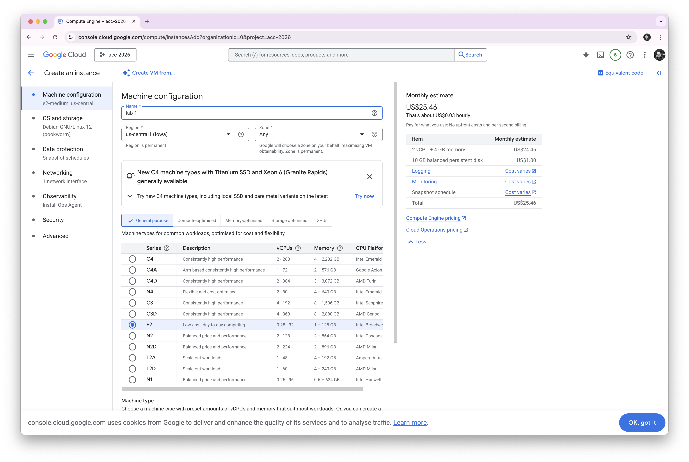
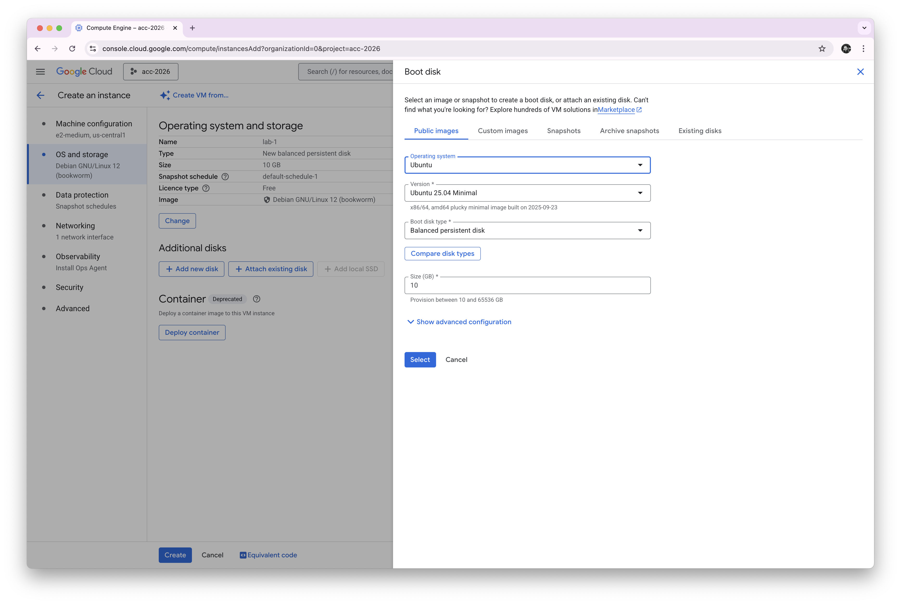
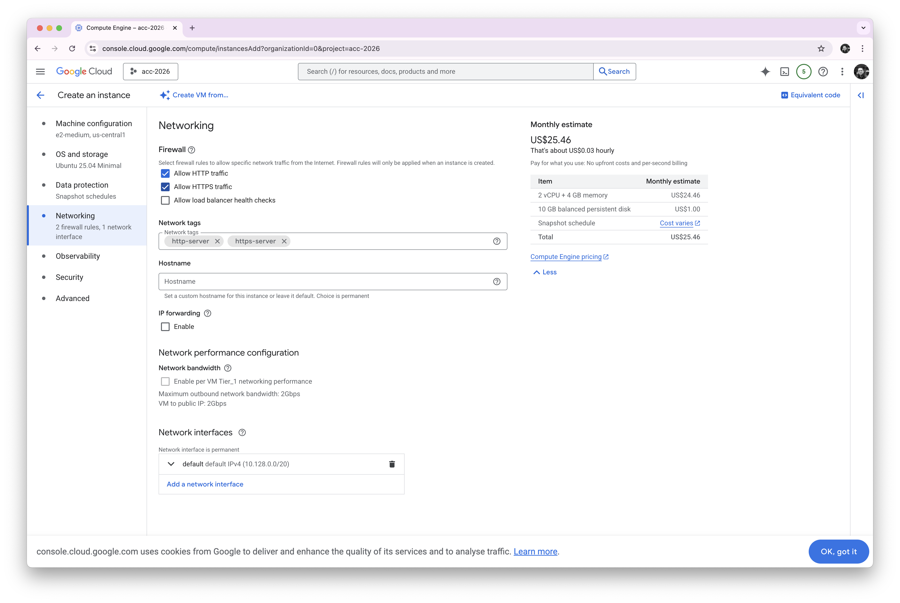

### How to Redeem Your GCP Coupon and Create Your First Virtual Machine

1. In the Moodle **Preparation** tile, click the **Student Coupon Retrieval Link.**

   Use your **Birkbeck email** to complete the form.

2. Check your email inbox and verify your account.  

3. After a short while, you will receive a second email containing your coupon code.  

> [!IMPORTANT]
>
> **From this point forward, use your personal Gmail account. Do not use your work's, organization’s or Birkbeck email.**
>
> **Only your personal email. If you don't have a personal gmail account please create.**
>
> Your Google Cloud coupon will be linked to your personal Gmail account, so make sure you redeem it there. This way, the coupon will stay yours.

4. **Enter the coupon code** on the screen and **click Accept and continue**.  

5. In the search bar, look for **Compute Engine**. If it doesn’t appear, type it manually.  

6. Create a new project: click on the project selector at the topleft corner (mine shows already acc-2026), then choose **New Project**.  

7. Name your project as you like. I entered acc-2026.  

8. Go back to **Compute Engine** and select **VM instances** from the sidebar.  

9. Click **Create a new instance.** You’ll be taken to a screen asking you to enable the Compute Engine API — click **Enable** to continue.

*Note: The screen may look slightly different in some cases. Follow the same and enable it.*  

10. Now, let’s create a virtual machine (VM). Click **Create Instance** and rename it to **lab-1**.  

11. Under **OS and storage**, click **Change** to select the operating system.  

12. Choose **Ubuntu** as your operating system. Leave the rest of the configurations as they are.

13. Go to **Networking** and enable both **HTTP** and **HTTPS** traffic.  That's all! Click on **Create** at the bottom of the page.

14. Your VM will now begin creating.  

15. After a minute, when it’s ready, click the **SSH** button.  

16. Click **Authorize** to allow access.  

17. You’re now ready to go! 🎉  

  

Try running a command like `ls`, which lists files and folders (you’ll see nothing yet).

18. Finally, delete the instance, we’ll create more in future labs.  

**🚀 You’re all set for your first class!**
