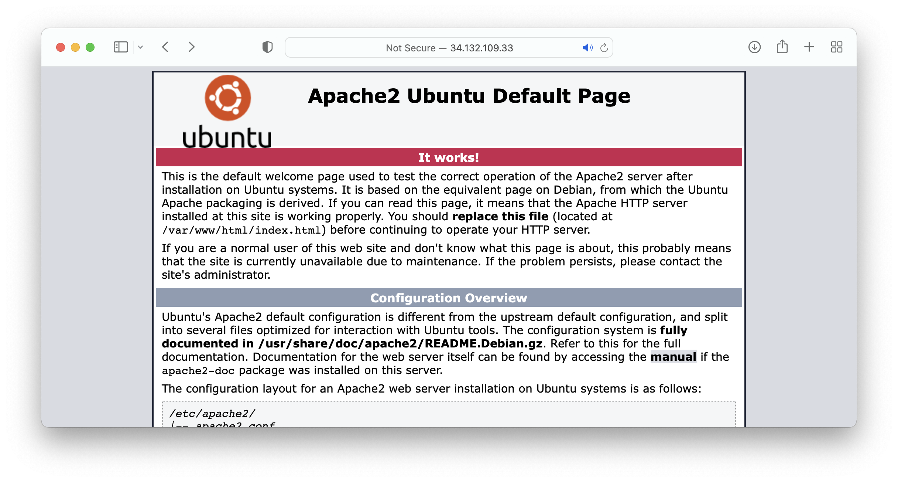

### Lab1.1: Introduction to Linux

#### What am I about to learn?

Today's lab session is essential to have a solid start in this module. Make sure you complete all the tasks before the next class.

Lab 1 part 1 focuses on how to:

**Lab 1.1 Part A**    Connect to your Virtual Machine (VM) in the Google Cloud Platform.

**Lab 1.1 Part B**    Learn how to run Linux commands using the command-line interface.


#### How to best approach the tutorials?

The labs are in the form of a complete step by step tutorial that you need to follow.

- Take your time and watch the videos of redeeming your coupon, creating a VM, and connecting using Visual Studio Code. Lab 1 exercise is an excellent way to assess the necessary skills required in this module.

- Do not just copy and paste the commands but try to understand the steps by typing in the commands.

- Developers who understand the command line would argue it's one of the best tools at your disposal. Understanding the use of the CLI and memorising basic commands are vital skills for every computer scientist. 

- Do not worry if you don't remember everything after the first class; we will have the opportunity to work with these commands again and again in the next ten weeks.

- I suggest you create an online logbook (e.g., a GitHub page) to keep notes of the essential commands.

- Do not be afraid to try the commands, again and again, to get used to it. Commands that could be potentially harmful (for example, delete a user etc.) will be highlighted during this lab.

  

####  Do you want to explore more the Linux command-line interface?

Download the [Linux Pocket Guide](https://www.dropbox.com/s/roe59y2gyghyq7b/Linux Pocket Guide%2C 3rd Edition.pdf?dl=0) and explore the commands. 

Do not copy and paste the commands as copying from this document and pasting into the terminal could turn text into gibberish (e.g. quotation marks etc.).


#### Lab 1.1 Part A: Preparing your workspace

You will need to watch the videos posted in preparation for the first class to run this tutorial.

1. Firstly, follow `Week 0` tutorial on redeeming your coupon and then creating a new VM. Go go ahead and create a new VM. You will use this VM for today's tutorial.

> You should be able now to create a new VM :white_check_mark:


#### Lab 1.1 Part B: Deploying a Cloud application

The following tutorial describes a list of commands to interact with the Linux system (Ubuntu 18.04) for installing our first Cloud application, the [Apache webserver](https://httpd.apache.org).

1. First, let’s see the current directory path using the `pwd` command.

2. Type `pwd` and press enter.

```shell
$ pwd

/home/user_name
```

> Your username is the actual Gmail username. 

3. Let's create a new user and then log in as the new user. To add a new user, run the `adduser` command.

> Enter a new password when prompted .
>
> :rotating_light: Do not expect to see any characters on the screen! 
>
> Then enter your user's details, e.g. full name, etc. You can leave this empty if you prefer. In the end, type Y (for Yes) and enter, and you are ready!

```shell
$ sudo adduser yoda

Adding user `yoda' ...
Adding new group `yoda' (1006) ...
Adding new user `yoda' (1005) with group `yoda' ...
Creating home directory `/home/yoda' ...
Copying files from `/etc/skel' ...
Enter new UNIX password: 
Retype new UNIX password: 
passwd: password updated successfully
Changing the user information for yoda
Enter the new value, or press ENTER for the default
	Full Name []: Yoda
	Room Number []: 
	Work Phone []: 
	Home Phone []: 
	Other []: 
Is the information correct? [Y/n] Y
```

4. Let's make user `yoda` a superuser. Then `yoda` will run commands with unrestricted access to all commands, files, directories, and resources.

```shell
$ sudo usermod -aG sudo yoda
```

5. Cool! We created a new user; let's log in as the new user.

```
$ sudo su yoda
```

> We might change our user, but we are still in the `/home/user_name` directory... 

6. Now, go to the `home/yoda` directory.

```shell
$ cd /home/yoda
```

7. Let's clear the terminal.

```shell
$ clear
```

8. We can use the `ls` command to list the files and folders of the `home/yoda` directory.

```shell
$ ls
```

9. An alternative way to list the contents is to use the directory path as a parameter in our command.

```shell
$ ls /home/yoda
```

> We can see that the /home/yoda folder is empty, so let’s create a folder and navigate to it.
>
> Let's create a new folder called `jedi` we will need to use the `mkdir` (make directory) command.

```shell
$ mkdir jedi
```

10. Change directory in the `jedi` folder using the `cd` command.

```shell
$ cd jedi
```

11. Use the `pwd` command to print the working directory.

```shell
$ pwd
/home/yoda/jedi
```

12. Change directory to the home folder of `yoda'.

```shell
$ cd ..
```

> Instead of `cd ..` we could use the `cd /home/yoda` command to navigate the desired directory.

13. Let’s create a file called `luke.txt` inside the `jedi` folder. We will use the `pico` text editor for Unix systems, preinstalled in our Ubuntu OS. 

    Let’s add the following text `Luke Skywalker was a Tatooine farmboy who rose from humble beginnings to become one of the greatest Jedi the galaxy has ever known`.

```shell
$ pico jedi/luke.txt 
```

> Add the text and then press the following combination of keys:
>
> * Press **control and S** to save the file
> * Press **control and X** to exit the file
>
> Now, we should be back in our terminal

14. Let's run the list command for the `jedi` folder.

```shell
$ ls jedi
luke.txt
```

15. Create a second file called `obi-wan.txt` and type in the following text `A legendary Jedi Master, Obi-Wan Kenobi was a nobleman and gifted in the ways of the Force`.

> :triangular_flag_on_post:  As before, use pico, type in the text and then **CTRL S**/**CTRL X** to save the file.

16. List the files of the jedi folder.

```shell
$ ls jedi
luke.txt  obi-wan.txt
```

17. Try the following command, which lists the contents of a folder, by printing the author of each file.

```shell
$ ls -l jedi
total 8
-rw-rw-r-- 1 yoda yoda 131 Jan  9 11:25 luke.txt
-rw-rw-r-- 1 yoda yoda  92 Jan  9 11:30 obi-wan.txt
```

> As expected, the files belong to `yoda`.
>
> Note, other editors are widely used in Unix systems such as [vi](https://en.wikipedia.org/wiki/Vi) and [emacs](https://en.wikipedia.org/wiki/Emacs), but in the labs, we use pico, and in most cases, we will edit our files using the Visual Studio Code.

18. Let’s create a copy of the `luke.txt`, using the `cp` command. We will call our new file `luke_copy.txt`, which is a clone file of `luke.txt`.

```shell
$ cp jedi/luke.txt jedi/luke_copy.txt
```

19. List the files and folders of the `jedi` folder.

```shell
$ ls jedi -l
total 12
-rw-rw-r-- 1 yoda yoda 131 Jan  9 11:25 luke.txt
-rw-rw-r-- 1 yoda yoda 131 Jan  9 11:38 luke_copy.txt
-rw-rw-r-- 1 yoda yoda  92 Jan  9 11:30 obi-wan.txt
```

20. Make a copy of the `obi-wan.txt`.

```shell
$ cp jedi/obi-wan.txt jedi/obi-wan-copy.txt
```

21. Let's delete the file `jedi/obi-wan-copy.txt`.

```shell
$ rm jedi/obi-wan-copy.txt
```

22. Let’s summarise the commands that we already used.

- `pwd` → Shows the directory path
- `ls` → Lists files and folders
- `cd testfolder` → Navigates to the testfolder
- cd .. → Navigates up one directory level
- `mkdir` → Creates a new directory
- `pico` → Unix editor (we need to save and exit using a combination of keys)
- `cp a.txt b.txt` → Create a copy of file a.txt to a new file b.txt
- `rm a.txt` → Deletes the a.txt file

23. Let's make a copy of the `jedi` folder (along with its contents).

```shell
$ cp -r jedi jedi_backup
```

24. Now, list the current folder's contents (I am in `/home/yoda`).

```shell
$ ls
jedi  jedi_backup
```

> Remember, I can always use the `pwd` command to see my current working directory.

25. Let’s delete the `jedi_backup` folder,  for this, we will use the `rm -rf` command, which deletes a folder forcefully. 
    - Forcefully, refers to enforcing commands to files that might be locked and used by other applications. If we don’t want to force deletion, we could also use `rm -r`. Let’s try the first one (by forcing deletion).

```shell
$ rm -rf jedi_backup
```

> List the contents of the working directory, the backup its not there anymore.

26. Edit the `luke-copy.txt` file and add the following text at the top of the file: `THIS IS A COPY`.

```shell
$ pico jedi/luke_copy.txt
```

> You will need to use the arrows to move the cursor inside the `pico` editor. Don't use your mouse in a terminal :)

27. We can see the contents of a file without necessarily editing it. We can use the `cat` (concatenate) command and see the result on the screen.

```
$ cat jedi/luke_copy.txt 
THIS IS A COPY

Luke Skywalker was a Tatooine farmboy who rose from humble beginnings to become one of the greatest Jedi the galaxy has ever known
```

28. Let’s summarise:

- `cp -r folder_A folder_B` → Creates a copy of a folder `folder_A` and its contents to a new folder `folder_B`
- `rm -rf` → Forces deletion of a folder recursively
- `cat afile.txt` → Reads file sequentially in the standard output


29. Now let’s install new software and make a simple configuration. We will install (or we can say we will deploy) the **[Apache webserver](https://httpd.apache.org)** to host a website.

* We will use the sudo apt install command.
* The sudo keyword refers to the superuser, a particular user with privileges to install the software. In our case, `yoda` is also a `sudo` superuser. 
* We will need to run this command as sudo. Note that you need to enter your password when prompted.

```shell
$ sudo apt install apache2
[sudo] password for yoda: 
Reading package lists... Done
Building dependency tree       
Reading state information... Done
The following package was automatically installed and is no longer required:
  libnuma1
Use 'sudo apt autoremove' to remove it.
The following additional packages will be installed:
  apache2-bin apache2-data apache2-utils libapr1 libaprutil1 libaprutil1-dbd-sqlite3 libaprutil1-ldap liblua5.2-0 ssl-cert
Suggested packages:
  www-browser apache2-doc apache2-suexec-pristine | apache2-suexec-custom openssl-blacklist
The following NEW packages will be installed:
  apache2 apache2-bin apache2-data apache2-utils libapr1 libaprutil1 libaprutil1-dbd-sqlite3 libaprutil1-ldap liblua5.2-0 ssl-cert
0 upgraded, 10 newly installed, 0 to remove and 7 not upgraded.
Need to get 1729 kB of archives.
After this operation, 6997 kB of additional disk space will be used.
Do you want to continue? [Y/n] Y
...
...
Processing triggers for man-db (2.8.3-2ubuntu0.1) ...
Processing triggers for ufw (0.36-0ubuntu0.18.04.2) ...
Processing triggers for ureadahead (0.100.0-21) ...
```

> You will need to use your `yoda` password and press `Y` when prompted.

30. The web server is installed and up and running! 

    Open your prefered browser and visit the IP address of your GCP called **External IP** VM. You will find the address in the GCP console, and it is the same that we used to connect using the `ssh` command.

    > As you can see, the Apache2 server is live!



> Note that we can edit the default `index.html` page stored in the `/var/www/html` folder.

37. Now let’s create a simple website and deploy it on our Apache2 web server. 

    First, let’s check where we are.

```shell
$ pwd
/home/yoda
```

> We are in our user `yoda` home folder, cool! Go on and clear your screen.

38. Let's create a new file in our local folder; we will call it `yoda-site.html`.

```shell
$ pico yoda-site.html
```

> We will need to use HTML to create a simple webpage.

39. Add the following script.

```html
<html>
<header> 
    <title> This is a Joda site! </title> 
</header>
    <body> 
    Hello World! I am Yoda!
    <p>
    
    </body>
</html>
```

> Save (CTRL S) and exit (CTRL X).

40. The Apache server default directory for websites is the `/var/www/html/`.

    This folder already exists as it was created when we installed the Apache web server, so we need to copy the file into the appropriate folder using the `cp` command.

```shell
$ sudo cp yoda-site.html /var/www/html/
[sudo] password for yoda: 
```

> You need to copy the file as sudo.

41. Go back to your browser and visit the new URL; this should be your `IP/yoda-site.html`. Your Yoda site, should be up and running!

> If you want to move the file, use the `mv` command. Instead of the cp command, you can run this if you don't want to copy the site in your home folder.

:checkered_flag: Well done! You completed part 1, now move to part 2 :clap:
