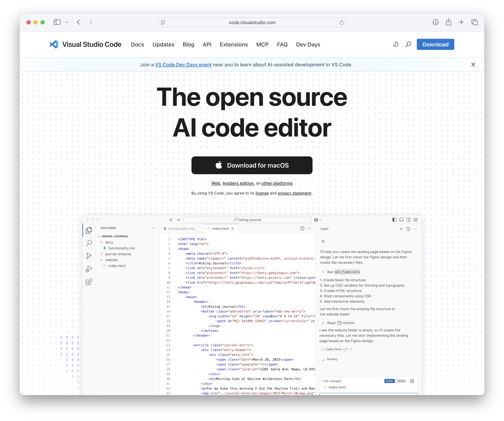
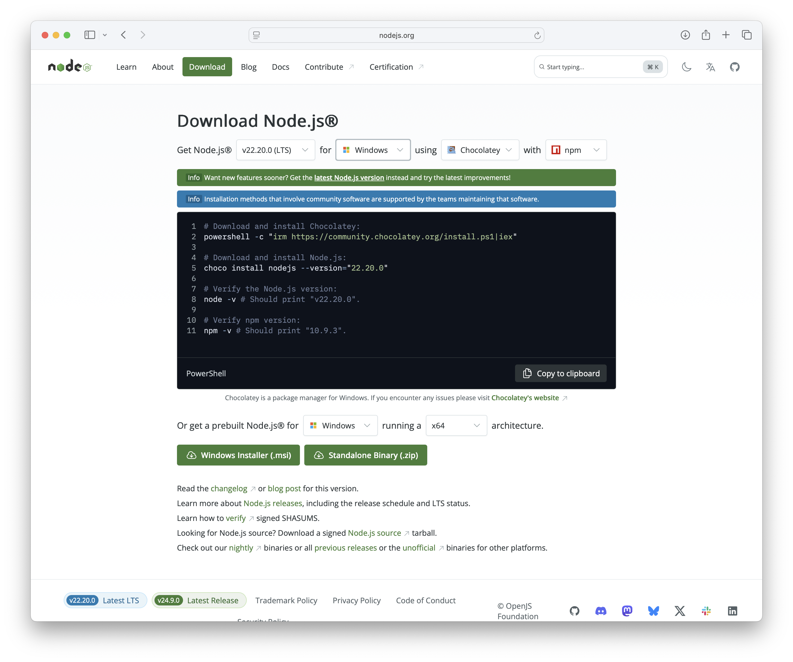
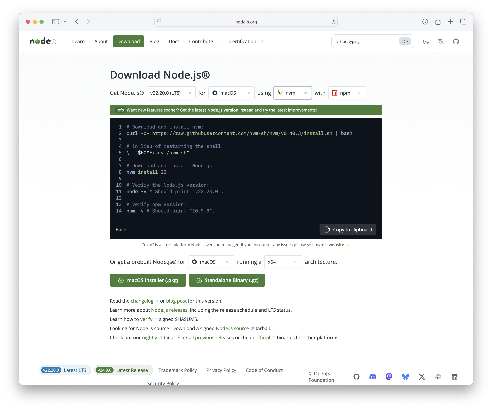
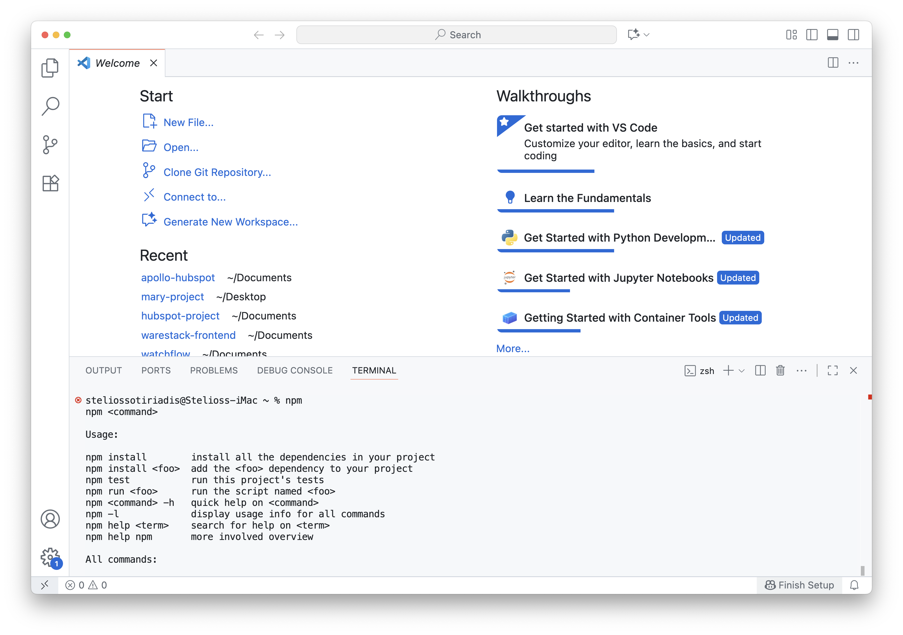

### Lab 2: Part 0 - Preparing your workspace

#### What you will learn

In this lab, we will set up our development environment for JavaScript and Node.js. By the end of this lab, you will:  

- Install Visual Studio Code (VS Code) → your main code editor.  
- Install Node.js → to run JavaScript tutorials.  
- Test your installation to make sure everything is working.  

This setup is the foundation for all the coding you’ll do in the next steps of the course. Think of it as preparing your workspace before starting to build a project.

---

#### Prepare your workspace

Before we start coding, we need to install Visual Studio Code (VSC) and Node.js that allows us to run JavaScript outside the browser and comes with **npm** (Node Package Manager) for installing extra libraries and tools. These will be your main tools for building and running applications.

#### Step 1: Install Visual Studio Code

1. Open your browser and go to the official download page: [https://code.visualstudio.com/](https://code.visualstudio.com/)

   > Tip: Open in new tab → Ctrl+Click (Win/Linux) or ⌘+Click (Mac).
   
   VS Code is a free code editor widely used for web development.



2. Download the installer for your operating system:
   - **Windows**: `VSCodeSetup-x64.exe`  
   - **MacOS**: `VSCode-darwin.dmg`

3. Run the installer and follow the setup wizard.

✅ Once installed, you can move on to the next step.

#### Step 2: Install Node.js

1. Visit the Node.js official website: [https://nodejs.org/en/download](https://nodejs.org/en/download) 

   >  Node.js allows you to run JavaScript on your computer. 
   >  It also installs **npm**, which lets you add extra tools and libraries (like the pip in Python).

2. For **Windows** users → download the `.msi` installer and install it.  



3. For **Mac** users → download the `.pkg` installer and install it.  



4. Accept the license agreement and keep the default installation options.

✅ Once installed, proceed to the final setup check.

#### Step 3: Test your setup

1. Open **Visual Studio Code** and start a new terminal. 
   (You can do this from the top menu: **Terminal → New Terminal**.)

2. Run the following command in the terminal:

```shell
npm
```



3. The outputs should confirm that node is now installed.

✅ Tutorial is completed. Continue to the [next part](lab2-part1.md).
