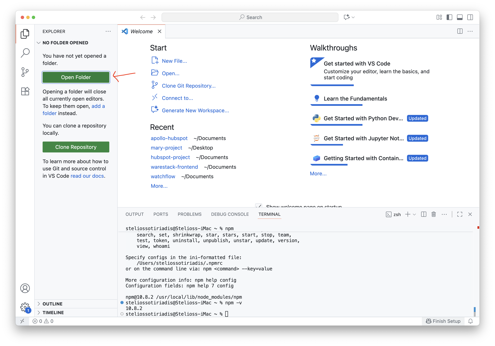
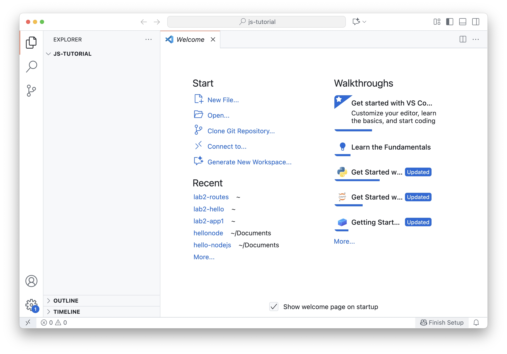
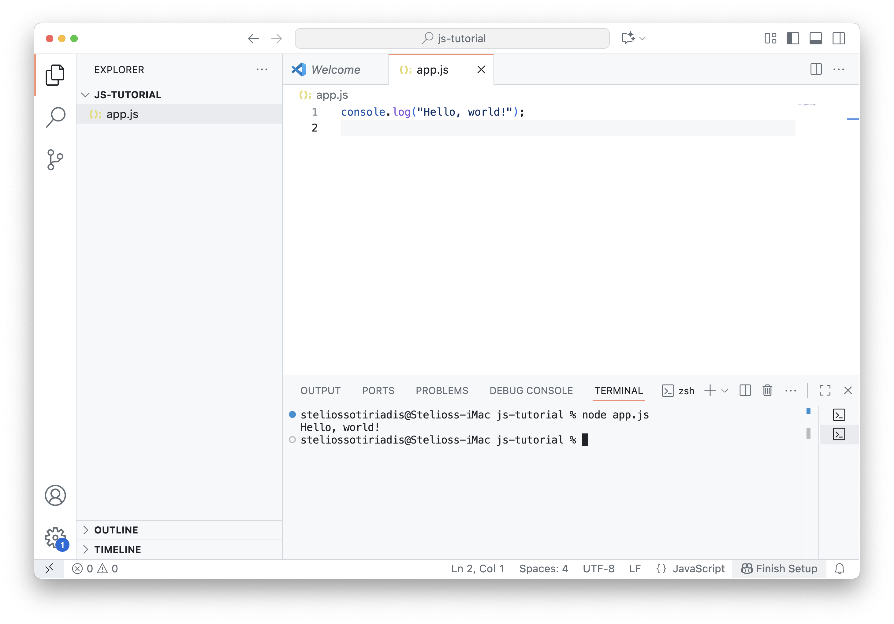

### Lab 2: Part 1 - JavaScript fundamentals

#### What you will learn

In this part of the lab, you will learn the basics of JavaScript and how to run your first program using Node.js.  If you already know Python, many of the concepts will feel familiar, the main difference is the syntax.

#### Step 1: JavaScipt fundamentals

1. You will need to create a folder to store your project data. Go to your `Documents` (or any folder you prefer) in your computer and create a new folder called `js-tutorial`.

2. Open **Visual Studio Code (VSC)** and then open the folder you just created as your project.



3. The folder `js-tutorial` is now open.



#### Step 2 JavaScript Basics Tutorial

JavaScript (often called JS) is a programming language of the web. It was first created to make websites interactive (e.g. buttons, forms, animations).  

Today, JavaScript is much more powerful:  

- It runs in the browser (frontend) to control web pages.  
- It runs on the server (backend) using Node.js.  
- It’s used to build web apps, mobile apps, games, and even desktop software.  

Let's explore the basics.

1. Create a file named `app.js`.
   
> For Windows press `Ctrl + N`, for Mac press `Cmd + N`, or go to `File` → `New File` from the top menu.

Add the following code and save it (Windows press `Ctrl + S`, Mac press `Cmd + S`).  

```js
console.log("Hello, world!");
```

> `console.log()` prints text to the console.

2. Open a new terminal (if not already open). To open a new terminal click on the `Terminal` and then `New Terminal`.

Let's run the `app.js` using the following command in the terminal.

```shell
node app.js
```

This is how my `app.js` and the terminal output looks like.



✅ Congratulations! You just ran your very first JavaScript program.

#### Step 3 Learning the basics of JS

1. In JS, you can define variables using the `let` and the `const`  (for constant variables).

   Here’s how to define a changeable variable (`name`) and a constant one (`pi`).

```js
// Using let (can change)
let name = "John";
console.log(name);
name = "Kate";
console.log(name);

// Using const (cannot change)
const pi = 3.1415;
console.log(pi);
```

> 💡 In JavaScript, semicolons (`;`) are optional in most cases because of a feature called Automatic Semicolon Insertion (ASI).
> You can either type `name = "Kate";` or `name = "Kate"`. For keeping this tutorial simple, I didn't include semicolons.
> However, it’s still recommended to use semicolons because:
>
> - It makes your code clearer and more consistent.
> - It prevents unexpected behavior in certain cases (like when a line starts with `(` or `[`).
> - Most style guides (e.g., Google, Airbnb) prefer using them.  

2. Let's explore the basic JS data types. We declare different types of variables and print their values and types in the console.

```js
let text = "Hello";      // String
let number = 42;         // Number
let isActive = true;     // Boolean
let nothing = null;      // Null
let notDefined;          // Undefined
let fruits = ["apple", "banana", "orange"]; // Array
let person = { name: "John", age: 25 };     // Object

// Print values and their types
console.log(text, ":", typeof text);
console.log(number, ":", typeof number);
console.log(isActive, ":", typeof isActive);
console.log(nothing, ":", typeof nothing);     // will show "object"
console.log(notDefined, ":", typeof notDefined);
console.log(fruits, ":", typeof fruits);       // will show "object"
console.log(person, ":", typeof person);       // will show "object"
```

> 💡 In JavaScript, both null and Array are reported as type object, this is a long-standing quirk of the language.

3. Basic operators in JavaScript look just like Python.

```js
let x = 10;
let y = 3;

console.log(x + y); // 13
console.log(x - y); // 7
console.log(x * y); // 30
console.log(x / y); // 3.333...
console.log(x % y); // 1 (remainder)
```

4. In JS, code blocks use the curly braces.

- In JavaScript: `if`, `for`, `functions`, etc. use curly braces `{ }`.  
- In Python, code blocks use indentation (spaces or tabs).  

Here is an example of a JS conditional block.

```js
let score = 85;

if (score >= 90) {
  console.log("A grade");
} else if (score >= 70) {
  console.log("B grade");
} else {
  console.log("C grade");
}
```

5. Explore a `for` and a `while` loop.

```js
// For loop
for (let i = 1; i <= 5; i++) {
  console.log("Number " + i);
}

// While loop
let n = 1;
while (n <= 3) {
  console.log("Count " + n);
  n++;
}
```

6. Creating JS functions are quite similar as Python.

```js
function greet(name) {
  return "Hello " + name;
}
console.log(greet("John")); // Hello John
console.log(greet("Maria")); // Hello Maria
```

7. This is a JavaScript object, which works very much like a Python dictionary.  

> 💡 Objects are at the heart of modern APIs because they let us store data in key–value pairs (e.g., `name: "Mary"`, `age: 25`). 

* Try the following code block.

```js
let student = {
  name: "Mary",
  age: 25,
  major: "Computer Science"
};

console.log(student.name);      // Mary
console.log(student["major"]);  // Computer Science
```

>  This structure makes it easy to organize and send data between applications, especially in JSON format, which is just a text version of objects.  
>
>  👉 In short: objects are the main way information is shared in web apps and APIs.

8. In JavaScript, an array is very similar to a list in Python. Both store a collection of values in order, and you can access them using an index that starts at `0`.  

```js
let colors = ["red", "green", "blue"];

console.log(colors[0]); // red
console.log(colors.length); // 3

colors.push("yellow"); // add at end
console.log(colors);
```

9. Finally, let’s look at a **JSON array of objects**. 

   This is very common in real-world APIs: you get a list (array) of objects, where each object has keys and values.  

```js
let students = [
  { id: "s1", name: "John Smith" },
  { id: "s2", name: "Maria Garcia" },
  { id: "s3", name: "Ali Khan" }
];

console.log(students[0].name); // John Smith
console.log(students[1].id);   // s2
```

---


#### 🤓 Quiz

> Remember `CTRL` or `CMD` and click to open the quiz in new tab.

[Try the quiz: **Select the learn mode**.](https://kahoot.it/solo/?quizId=c41b5245-0de5-4f1c-9469-47a6e9133ae9)

#### Exercise

Try it yourself: Loop through the array and print the title of every book.

```js
[
  { id: "b1", title: "1984", author: "George Orwell", year: 1949 },
  { id: "b2", title: "To Kill a Mockingbird", author: "Harper Lee", year: 1960 },
  { id: "b3", title: "The Hobbit", author: "J.R.R. Tolkien", year: 1937 }
];
```

> 🚀 Avoid scrolling down to the solution until you’ve tried it.

#### Solution

↓↓↓↓↓↓↓↓↓↓↓↓↓↓↓↓↓↓↓↓↓↓↓↓↓↓↓↓↓↓↓↓↓↓↓↓↓↓↓↓↓↓↓↓↓↓↓↓↓↓↓↓↓↓↓↓↓↓↓↓↓↓↓↓↓↓↓↓↓↓↓↓↓↓↓↓↓↓↓↓↓↓
↓↓↓↓↓↓↓↓↓↓↓↓↓↓↓↓↓↓↓↓↓↓↓↓↓↓↓↓↓↓↓↓↓↓↓↓↓↓↓↓↓↓↓↓↓↓↓↓↓↓↓↓↓↓↓↓↓↓↓↓↓↓↓↓↓↓↓↓↓↓↓↓↓↓↓↓↓↓↓↓↓↓
↓↓↓↓↓↓↓↓↓↓↓↓↓↓↓↓↓↓↓↓↓↓↓↓↓↓↓↓↓↓↓↓↓↓↓↓↓↓↓↓↓↓↓↓↓↓↓↓↓↓↓↓↓↓↓↓↓↓↓↓↓↓↓↓↓↓↓↓↓↓↓↓↓↓↓↓↓↓↓↓↓↓


```js
// Loop through each book in the array
let books = [
  { id: "b1", title: "1984", author: "George Orwell", year: 1949 },
  { id: "b2", title: "To Kill a Mockingbird", author: "Harper Lee", year: 1960 },
  { id: "b3", title: "The Hobbit", author: "J.R.R. Tolkien", year: 1937 }
];

for (let i = 0; i < books.length; i++) {
  console.log("ID:", books[i].id);
  console.log("Title:", books[i].title);
  console.log("Author:", books[i].author);
  console.log("Year:", books[i].year);
  console.log("---");
}

// Alternative solution

for (const book of books) {
  console.log(book.title);
}
```

From the top menu, go to `File` > `Close Folder` to close your folder.

✅ Tutorial is completed. Continue to the [next part](lab2-part2.md).
