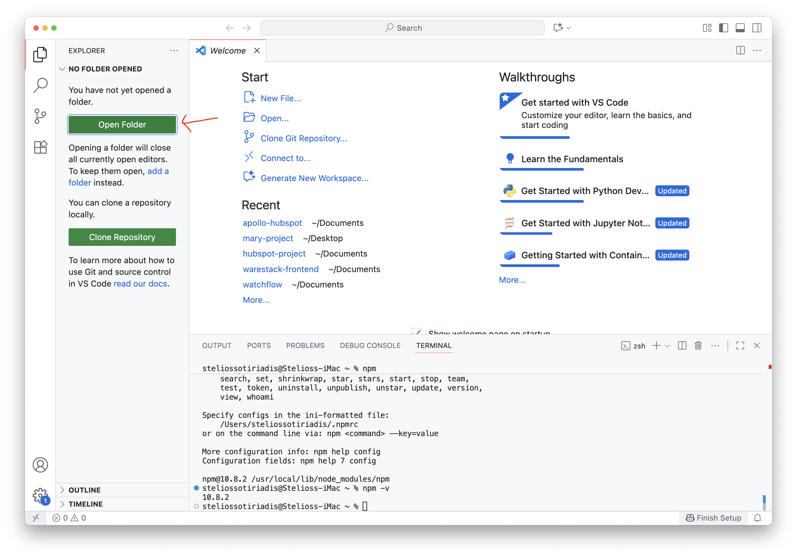

### Lab 2: Part 2 - Introduction to NodeJS with express

By the end of this part, you will be able to:  
- Set up a basic Node.js project with Express.  
- Create simple routes and run your first web server.  
- Start and stop the server from the terminal.  

Let’s set up our very first Node.js server using Express.

1. Let's start with a fresh project. Go to your `Documents` folder (or anywhere you prefer) and create a new folder called `lab2-hello`.
2. In VSC, open a new folder.



3. In the terminal, we need to initialize our project. In the terminal, I’ll type:

```shell
npm init -y
```

This creates a package.json file, which keeps track of our project’s settings and dependencies.

4. Next, let’s install Express, which is the framework we’ll use, and Nodemon, which will restart our server automatically whenever we make changes.

```shell
npm install express nodemon
```

5. Now, we need to tell Node how to start our server. So inside the `package.json` file, I’ll adapt the scripts section to look like this:

```
"scripts": {
  "start": "nodemon app.js"
}
```


>  That way, every time I run `npm start`, Nodemon will launch `app.js` and keep it running.

6. Now let’s actually create the server. Create a new file called `app.js` and in the file, I’ll start by importing Express:

```js
const express = require('express')
const app = express()
```

Then I’ll define my first route, the home route, just `/`.

```js
app.get('/', (req, res) => {
    res.send("Hello world!")
})
```

Let's define a second route.

```js
app.get('/hello', (req, res) => {
    res.send("world!")
})
```

Finally, we need to make the server listen on a port. I’ll pick port `3000`.

```js
app.listen(3000)
```

Here is how it looks like.


7. Now if I go back to the terminal and type:

```shell
npm start
```

The server is running. If I open my browser and visit `http://localhost:3000`, I’ll see the **Hello world!**

Try the `http://localhost:3000/hello` endpoint too.


8. Press click within the terminal area and then `CTRL`+`C` to stop the server.

> (Hold the `Control` key and press `C`).

🎉 That’s it, we just built our very first Express server! This small app is the foundation for building APIs and web applications.

✅ Tutorial is completed. Continue to the [next part](lab2-part3.md).
