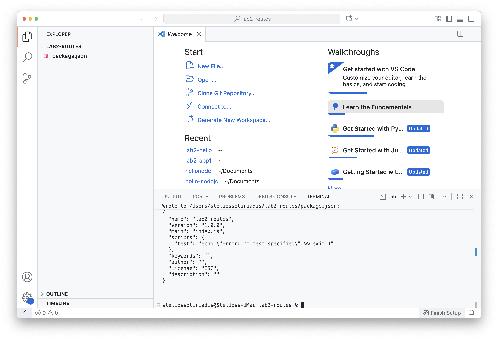
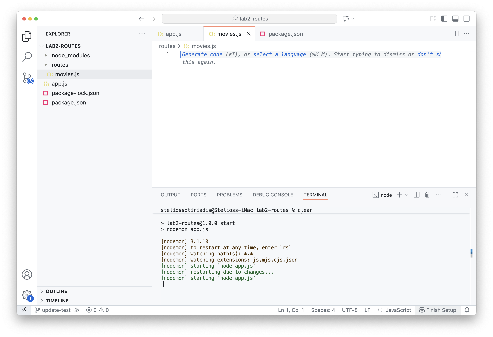
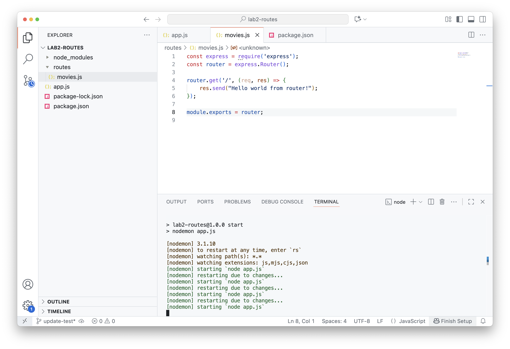
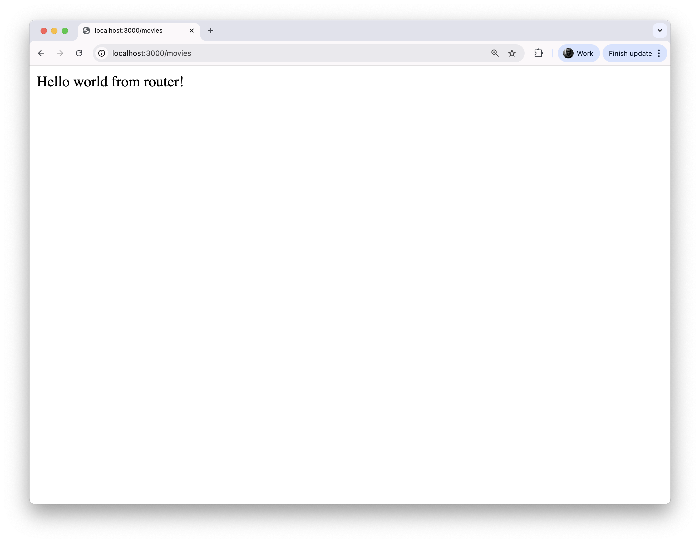
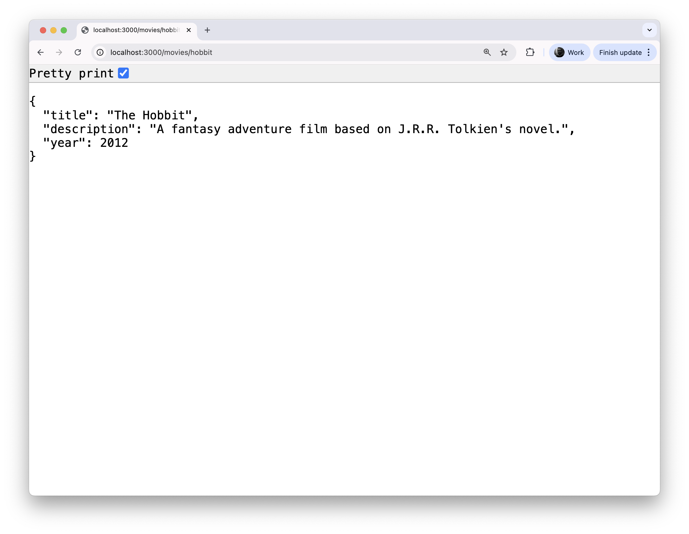

### Lab 2: Part 3 - Running an app using `routers`

By the end of this part, you will be able to:  

- Organize your Express app using **routers**.  
- Create separate route files and connect them to `app.js`.  
- Build cleaner and more scalable APIs.  

Let's start!

We’ll need to improve our Express app by using routers.  Routers help us organize our routes into separate files instead of keeping everything in `app.js`.

> Routers are good because they keep your code clean and organized by moving routes into separate files. This makes your app easier to read, maintain, and scale as it grows.

1. Let's start with a new clean project. Go to VSC and in the menu  `File` click `New Window`.
2. Create a new folder, e.g. `lab2-routes` and use it as a project in VSC.



3.  Quickly setup the project space.

```shell
npm init -y
```

```shell
npm install express nodemon
```

Edit the `package.json` with the following update.

```js
"scripts": {
  "start": "nodemon app.js"
}
```

Create the `app.js` file and add the boilerplate code.

```js
// Import the Express library
const express = require('express');
const app = express();

// Define a route for "/"
app.get('/', (req, res) => {
    res.send("Hello world!");
});

// Start the server on port 3000
app.listen(3000);
```

```shell
npm start	
```

> Check by visiting the `http://localhost:3000/` endpoint.

We are now ready!

4. We are going to create our first route.

Create a folder `routes` and inside it create a file called `movies.js`



This will create an endpoint (URL) `http://localhost:3000/movies`

5. Add the following code.

Fist import `express` and create the `router`.

```js
const express = require('express');
const router = express.Router();
```

Then define the routes for `/movies`.

```js
router.get('/', (req, res) => {
    res.send("Hello world from router!");
});
```

🔍 Explanation: 

We use routers to keep our code organized and easy to manage.

Without routers, all routes (like `/`, `/movies`, `/users`) would be in one big file, messy and hard to maintain. Other than keeping your code clean, you can reuse and test parts of your app more easily.

Finally `export` the router and make it available to `app.js`.

```js
module.exports = router;
```

The final file should look like that.



6. Go back to `app.js` and update the file by:

a) imporing the `movies` route and 

b) using it in the app.

```js
const express = require('express');
const app = express();

// 1. Import the movies router
const moviesRoute = require('./routes/movies');

// 2. Use the router
app.use('/movies', moviesRoute);

app.get('/', (req, res) => {
    res.send("Hello world!");
});

app.listen(3000);
```

🔍 Explanation:
- This line means: `const moviesRoute = require('./routes/movies')` means go to the folder routes, find the file movies.js, and load everything it exports (that's why you need the `module.exports = router;`. It’s like connecting your main app to another file that handles movie-related routes.
- This line `app.use('/movies', moviesRoute)` creates a path in your `app: /movies`. Everything inside movies.js will now live under that path.

Save the changes and open the endpoint in the browser `http://localhost:3000/movies`.



7. Head back to your `movies.js` and add another one. 

This is a new endpoint `http://localhost:3000/movies/hobbit`. Note that every route inside `movies.js` is prefixed with `/movies`.

```js
router.get('/hobbit', (req, res) => {
  res.json({
    title: "The Hobbit",
    description: "A fantasy adventure film based on J.R.R. Tolkien's novel.",
    year: 2012
  });
});
```

> 💡  Note:
>  `res` → is the response object provided by Express.
> `.json()` → sends data in JSON format (JavaScript Object Notation).
> The { ... } → is a JavaScript object containing key–value pairs (like a small dataset).

Save it and then visit the URL and test that it works.



You just learned how to create your first routers! 

✅ Tutorial is completed. Continue to the [next part](lab2-part4.md).
