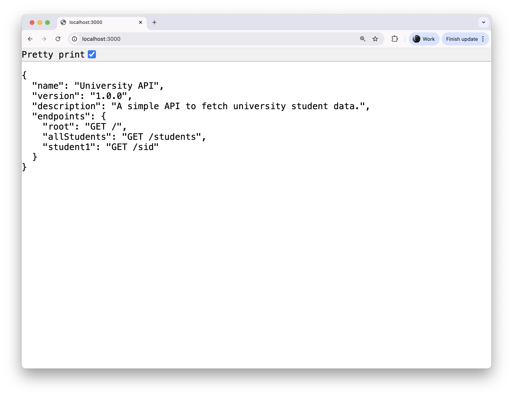

### Lab 2: Part 4 - Exercise

Time to put your understanding in practice!

You will need to **replicate the following API endpoints** using the appropriate data.  Before starting, study the boilerplate code provided at the bottom of this tutorial.  

> Your goal is to put everything together and make the API run in your browser. Create a new fresh project in VSC and setup your NodeJS workspace. Then create the appropriate routes for each of the pages.

Your API should support:

GET` /` → Welcome page with API description.

GET `/students` → Returns all students.

GET `/students/s1` → Returns details of the first student.

GET `/students/s2` → Returns details of the second student.

GET `/students/s3` → Returns details of the third student.

Here is a screenshot of the home `/` endpoint.  



Here is a screenshot of the home `/students` endpoint.  


Here is a screenshot of the home `/students/s1` endpoint.  


Bellow is the data that the home `/` endpoint should return (copy it from here).

```json
{
    name: 'University API',
    version: '1.0.0',
    description: 'A simple API to fetch university student data.',
    endpoints: {
      root: 'GET /',
      allStudents: 'GET /students',
      student1: 'GET /sid'
    }
}
```

Here is the student data that the `/students` endpoint should return. 

* Your task is to make sure the API can also return each student individually. For example, `/students/s1` should only return the student with ID `s1`."

```json
{
  s1: {
    name: 'John Smith',
    studentId: 'S12345',
    major: 'Computer Science',
    year: 2
  },
  s2: {
    name: 'Maria Garcia',
    studentId: 'S54321',
    major: 'Mathematics',
    year: 3
  },
  s3: {
    name: 'Ali Khan',
    studentId: 'S77777',
    major: 'Data Science',
    year: 1
  }
}
```

#### Boilerplate code

As an example, consider the following code consisting of two books.

* Inside your router file, you can store a JavaScript object that holds book data like this:

```
const books = {
  b1: {
    title: "1984",
    author: "George Orwell",
    year: 1949
  },
  b2: {
    title: "To Kill a Mockingbird",
    author: "Harper Lee",
    year: 1960
  },
  ...
};
```

* To return all books at once, you can simply send the entire object as the response like this:

```js
...
  res.json(books);
...
```

When you visit `http://localhost:3000/books/`, you’ll see all two books.

* To return a single book, use the key name (`b1`, `b2`, `b3`) as the search parameter. 
  For example using the `:id` you can extract the book id from the endpoint and then extract it from the JavaScript object directly.

```
// GET /books/:id → one book by id (b1, b2, b3)
router.get('/:id', (req, res) => {
  const book = books[req.params.id];
  res.json(book);
});
```

**Understanding `/:id` and `req.params.id`**

- `/:id` → a placeholder in the route URL.
  Example: `/books/:id` matches `/books/b1`, `/books/b2`, etc.  

- `req.params.id` → gives the actual value from the URL.  
  - `/books/b1` → `req.params.id = "b1"`  
  - `/books/b2` → `req.params.id = "b2"`  

👉 In short: `/:id` defines the variable, `req.params.id` reads it.