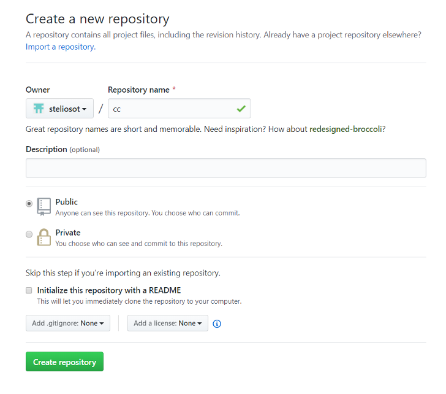
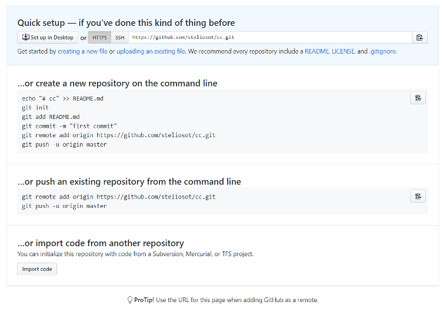

### Lab3.2: Pushing code to GitHub

#### What am I about to learn?

* We will learn how to push our code to a GitHub repo!

For this tutorial, you will need to download and install GitHub on your local computer.

* To install GitHub follow the next tutorial:
  * [Installation guide for Windows, Mac and Linux users](https://github.com/git-guides/install-git)
  * A new video on how to set up GitHub to push our code will be released soon!

#### Lab 3.2: Step by step guide

1. Set up your GitHub account, select a repo name and create the new repository.



2. Copy the HTTPS URL.

3. We are now ready to push our code to the repo! Open a terminal or a powershell. Make sure GitHub is installed using the next command.

```
$ git --version
git version 2.34.1
```

4. Configure your user name and email as follows (use your GitHub username and email). These are the commands that you need to run.

```shell
$ git config --global user.name "Stelios"
```

```shell
$ git config --global user.email youremail@domain.com
```

5. Now move to your app folder. You can run the next commands in your VSC terminal while you are in your node.js project app folder.

```shell
$ git init	
```

6. Add the GitHub repo as the origin.

```shell
$ git remote add origin https://github.com/steliosot/cc.git
```

7. Before you push the data, we will need to make sure that we don't push the `.env` file! For the moment, make sure you **delete the DB connection string from your `.env` file**. We will see soon how to use the `.gitignore` files to help us with this.
7. Add all the files.

```shell
$ git add . 
```

8. Commit the changes (with a message)

```shell
$ git commit -m "Pushing my app files"
```

9. Upload the files in the repository.

```shell
$ git push -f origin master
```

10. Done! You should be able to see your file online