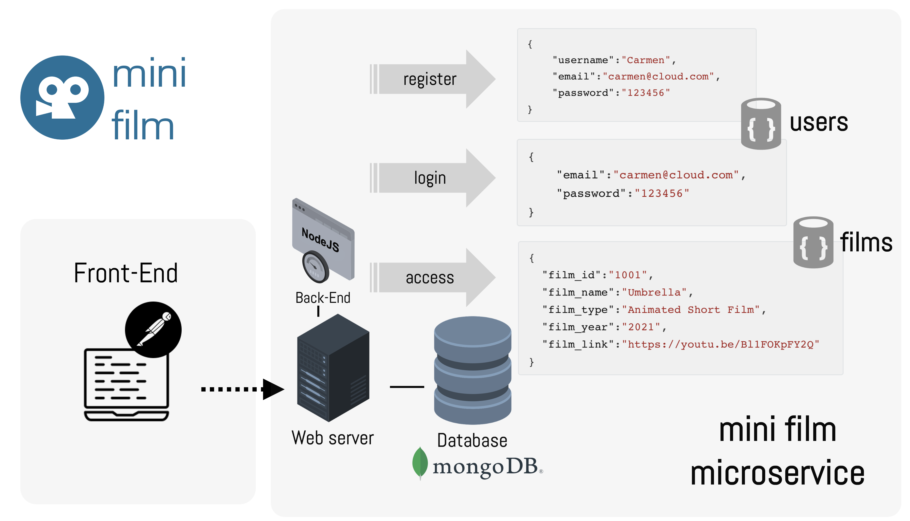

### Lab4.1: MiniFilm REST Verification and Authentication

#### What am I about to learn?

Today's lab session focused on how to adapt the MiniFilm REST service by incorporating validation and authentication methods.

Lab 4 focuses on how to:

* Conceptualise a REST API development for:
  * Enforcing validations using the `joi` express library
  * Enforcing authentication using the `jsonwebtoken` library
* We will use a MongoDB instance on the MongoDB Atlas

The following image demonstrates the MiniPost microservice architecture.



#### Lab 4.1: Building the MiniPost application with MongoDB

You will need to watch the next video on how to install and run a Node.js app.

> Take your time, make sure you double-check the code and debug your code as you go.

1. Firstly, watch the following video.

[](https://youtu.be/60SGb-CSB9Y)

> You should run this tutorial on your personal computer :white_check_mark:

2. Here, you will find the commands and scripts that I created in this video. Assuming that you already installed NodeJS on your personal computer, and you are already in your project folder, you can initialise a NodeJS application using the following script.

```shell
$ npm init
```

> npm is the node package manager that gives us access to the online repository of Node. 

3. For this tutorial, we need to install the `express` package, the `nodemon` tool,  the `mongoose` driver to connect to the MongoDB cluster, the `body-parser` to parse body data as JSON objects, and the `dotenv` that allows you to separate secrets from your source code.

```shell
$ npm install express nodemon mongoose body-parser dotenv joi bcryptjs jsonwebtoken
```

> You can install all packages at the same time using one command.

4. Make sure you edit the `package.json` and adapt the `scripts` key to the following value (as shown in the video).

```javascript
...
"scripts": {
  "start":"nodemon app.js"
}
```

5. You will need to create a new MongoDB collection using the MongoDB atlas. Watch the video on how to connect and deploy your first MongoDB cluster.

> [Link](https://www.mongodb.com/cloud/atlas/lp/try2?utm_source=google&utm_campaign=gs_emea_united_kingdom_search_core_brand_atlas_desktop&utm_term=mongodb%20atlas%20login&utm_medium=cpc_paid_search&utm_ad=e&utm_ad_campaign_id=12212624581&adgroup=115749705303&gclid=CjwKCAiA55mPBhBOEiwANmzoQrRYt9_LM38WefyAApthSkD3j0I_soqf9RiNSKQnr2YL9oaLhXJEEhoChb4QAvD_BwE) to connect to the MongoDB cluster.

6. This is an example of a data instance of the mongoose model that we use in this tutorial. The data is in JSON format.

```json
{
    "username":"Stelios",
    "email":"stelios@cloud.com",
    "password":"123456"
}
```

5. The next script is the code used in the `app.js` file.

```javascript
const express = require('express')
const app = express()

const mongoose = require('mongoose')
const bodyParser = require('body-parser')
require('dotenv/config')

app.use(bodyParser.json())

const filmsRoute = require('./routes/films')
const authRoute = require('./routes/auth')

app.use('/api/film',filmsRoute)
app.use('/api/user',authRoute)

mongoose.connect(process.env.DB_CONNECTOR).then(()=>{
    console.log('Your mongoDB connector is on...')
})

app.listen(3000, ()=>{
    console.log('Server is running')
})
```

6. We created a new model called `User.js` inside the  `models` folder.

```javascript
const mongoose = require('mongoose')

const userSchema = mongoose.Schema({
    username:{
        type:String,
        require:true,
        min:3,
        max:256
    },
    email:{
        type:String,
        require:true,
        min:6,
        max:256
    },
    password:{
        type:String,
        require:true,
        min:6,
        max:1024
    },
    date:{
        type:Date,
        default:Date.now
    }
})
module.exports=mongoose.model('users',userSchema)
```

7. And, we have reused the `Film.js` inside the  `models` folder.

```javascript

const mongoose = require('mongoose')

const filmSchema = mongoose.Schema({
    film_name:{
        type:String
    },
    film_type:{
        type:String
    },
    film_year:{
        type:String
    },
    film_link:{
        type:String
    }
})

module.exports = mongoose.model('films',filmSchema)
```

8. We created the `auth.js` file inside a new `routes` folder.

```javascript
const express = require('express')
const router = express.Router()

const User = require('../models/User')
const {registerValidation,loginValidation} = require('../validations/validation')

const bcryptjs = require('bcryptjs')
const jsonwebtoken = require('jsonwebtoken')

router.post('/register', async(req,res)=>{

    // Validation 1 to check user input
    const {error} = registerValidation(req.body)
    if(error){
        return res.status(400).send({message:error['details'][0]['message']})
    }

    // Validation 2 to check if user exists!
    const userExists = await User.findOne({email:req.body.email})
    if(userExists){
        return res.status(400).send({message:'User already exists'})
    }

    // I created a hashed represenation of my password!
    const salt = await bcryptjs.genSalt(5)
    const hashedPassword = await bcryptjs.hash(req.body.password,salt)

    // Code to insert data
    const user = new User({
        username:req.body.username,
        email:req.body.email,
        password:hashedPassword
    })
    try{
        const savedUser = await user.save()
        res.send(savedUser)
    }catch(err){
        res.status(400).send({message:err})
    }
    
})

router.post('/login', async(req,res)=>{

    // Validation 1 to check user input
    const {error} = loginValidation(req.body)
    if(error){
        return res.status(400).send({message:error['details'][0]['message']})
    }

    // Validation 2 to check if user exists!
    const user = await User.findOne({email:req.body.email})
    if(!user){
        return res.status(400).send({message:'User does not exist'})
    } 
    
    // Validation 3 to check user password
    const passwordValidation = await bcryptjs.compare(req.body.password,user.password)
    if(!passwordValidation){
        return res.status(400).send({message:'Password is wrong'})
    }
    
    // Generate an auth-token
    const token = jsonwebtoken.sign({_id:user._id}, process.env.TOKEN_SECRET)
    res.header('auth-token',token).send({'auth-token':token})

})

module.exports=router
```

9. We created a `validations.js` file to control user input validations.

```javascript
const joi = require('joi')

const registerValidation = (data) => {
    const schemaValidation = joi.object({
        username:joi.string().required().min(3).max(256),
        email:joi.string().required().min(6).max(256).email(),
        password:joi.string().required().min(6).max(1024)        
    })
    return schemaValidation.validate(data)
}

const loginValidation = (data) => {
    const schemaValidation = joi.object({
        email:joi.string().required().min(6).max(256).email(),
        password:joi.string().required().min(6).max(1024)        
    })
    return schemaValidation.validate(data)
}

module.exports.registerValidation = registerValidation
module.exports.loginValidation = loginValidation
```

10. To control the authentication process we used the  `verifyToken.js` file.

```javascript
const { send } = require('express/lib/response')
const jsonwebtoken = require('jsonwebtoken')

function auth(req,res,next){
    const token = req.header('auth-token')
    if(!token){
        return res.status(401).send({message:'Access denied'})
    }
    try{
        const verified = jsonwebtoken.verify(token,process.env.TOKEN_SECRET)
        req.user=verified
        next()
    }catch(err){
        return res.status(401).send({message:'Invalid token'})
    }
}

module.exports=auth
```

11. And finally, we have our updated `films.js` route to apply the verification process.

```javascript
const express = require('express')
const router = express.Router()

const Film = require('../models/Film')
const verifyToken = require('../verifyToken')

router.get('/', verifyToken, async(req,res) =>{
    try{
        const films = await Film.find()
        res.send(films)
    }catch(err){
        res.status(400).send({message:err})
    }
})

module.exports = router
```

:checkered_flag: Well done! You completed lab 4! 

Now create your own data schema and implement validation and verification operations in Node.js! :clap:
