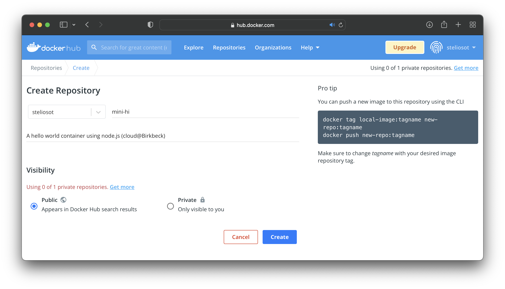

###  Lab6: Deploying on Kubernetes

#### What am I about to learn?

Today's lab session focuses on Kubernetes! We will create a new Kubernetes cluster and deploy a containerized application.

The Bonus Lab focuses on how to:

* Deploy Kubernetes on the Google Kubernetes Engine (GKE) in GCP.
* Run the basic commands to interact with and push Docker images to Docker Hub.
* Deploy images from Docker Hub to Kubernetes.
* Horizontally scale images to support increased traffic using a load-balancing service.

You will need to watch the following video to follow the step-by-step commands.

> Take your time and make sure you double-check the commands before you run them.

* The following video demonstrates the commands used in this tutorial. 

[](https://youtu.be/LS0UvkbA9Pw)

> **You should run this tutorial on your GCP VM and the Google Cloud Shell :white_check_mark:**

* To run this tutorial, you will need a GCP VM; you must use the Docker VM that we created in Lab 5.

1. Let's start! First, go to Docker Hub and create a new account. We will use Docker Hub to push our images to deploy on Kubernetes.
   * The link to Docker Hub: [Docker Hub](https://hub.docker.com/)
2. Create a new public repository. 
   * Add a name and a description; your Docker Hub username is in the top right corner of your screen.



3. Go back to your Docker VM (from Lab 5) and log in to Docker Hub using your Docker user.

* If you deleted your VM, create a new one, and then install Docker.

```bash
$ docker login -u steliosot
```

> In the VM, do not forget to switch to `docker-user`. The command is `su - docker-user`; we ensure that we log in and switch to the docker-user home directory using this option.
> Important: Make sure you run Docker commands with the correct permissions.
> 
> Most Docker commands need elevated privileges — so either prefix them with sudo or add your user to the docker group and log out/in.
> While some commands (like docker login) might work without sudo, mixing privileged and non-privileged Docker commands can cause confusing issues later — especially when running docker push.

4. Feel free to use the mini-hi repo or create your own.

* If you create your application, you will need to create a new repo, push your code, and clone it in the VM.
* In my case, I used the public: `mini-hi.git`. If you like, go on and examine it.

```bash
$ git clone --branch main https://github.com/steliosot/mini-hi.git
```

> If you want, you can install Docker on your own computer.
>
> * Link to Docker Desktop: [Docker Desktop](https://docs.docker.com/get-docker/) and push your image from your own computer, rather than moving everything to the VM.
>
> The `mini-hi` app is nothing more than a simple Node.js server with a Hello World message. My `app.js` looks like this:
>
> ```javascript
> const express = require('express')
> const app = express()
> 
> app.get('/',(req,res)=>{
>     res.send('Hello World! Cloud@Birkbeck is fun!')    
> })
> 
> app.listen(3000)
> ```

5. Let's start!

```bash
$ cd mini-hi/
```

6. The Dockerfile is already there (I created it for you 😊), so let's examine it.

```dockerfile
$ cat Dockerfile

# Use a lightweight base image
FROM alpine

# Install Node.js and npm
RUN apk add --no-cache nodejs npm

# Set working directory
WORKDIR /src

# Copy package files first (for efficient caching)
COPY package*.json ./

# Install dependencies (e.g., express and others)
RUN npm install

# Copy the rest of the application code
COPY . .

# Expose application port
EXPOSE 3000

# Start the application
CMD ["node", "app.js"]
```

> Usual stuff... 👍

7. Now `build` our image.

* The image name format should be the following:
  * **<DockerHub-username>/<image-name>:<version>**
  * Make sure you change the following command and don't forget the `.` (dot) at the end (I always do).

```bash
$ docker image  build -t steliosot/mini-hi:1 .
```

8. Let's `push` our image to Docker Hub.

```bash
$ docker push steliosot/mini-hi:1

The push refers to repository [docker.io/steliosot/mini-hi]
c286528ccc74: Pushed 
03065d34267b: Pushed 
8d3ac3489996: Mounted from library/alpine 
1: digest: sha256:0c9e3709378e9898234377430d34 size: 951
```

9. Go back to your Docker Hub and refresh your page; your image should be there now!

10. Find it using the `docker search` command and your username.

```bash
$ sudo docker search steliosot

NAME    	DESCRIPTION        		STARS     OFFICIAL   AUTOMATED
steliosot/mini-hi   A hello world container using node.js (cloud…   0 
```

* 0 stars yet 😅 but it's a start 😄

11. Now time to move to Kubernetes.

12. Create a Kubernetes cluster (GKE Standard) using the GKE.

> **Make sure you switch to a Standard cluster.**

* You only need to provide a meaningful name, e.g., *my-gke-cluster*.
* By default, we will deploy **3** nodes.
* This might take some time, so sit tight!

> **Follow the instructions on the video on how to create your cluster.**

Briefly the steps include: 
- Enable the Kubernetes Engine API: In Google Cloud Console, search for “Kubernetes Engine”. If prompted, click “Enable” to activate the API.
- Open Kubernetes Clusters Page: Go to Kubernetes Engine → Clusters. Click “+ Create”.
- Choose the Cluster Mode: By default, Google Cloud now suggests an Autopilot cluster. For manual control and settings (as shown in the video), click “Switch to Standard cluster”. Alternatively, from the clusters page, use the “+ Create → Standard” option.
- Configure the Cluster: Set a name, region/zone, and other settings as shown in the tutorial (e.g. number of nodes, machine type).
- Create the Cluster: Click “Create” and wait for Google Cloud to provision the cluster. Once ready, you’ll see its status as “Running”.

13. Activate the Cloud Shell, and deploy our app in Kubernetes!

14. First, connect to the Kubernetes cluster. Click on the cluster name, then on the **Connect** button, and copy the long command. It looks like this:

```bash
$ gcloud container clusters get-credentials stelios-cluster13 --zone us-central1-c --project lab-7-270015
```

* What is `gcloud`?
  * The Google Cloud CLI is a set of tools to create and manage Google Cloud resources [[gcloud CLI overview](https://cloud.google.com/sdk/gcloud)]. 

15. Run the command in the **Cloud Shell**, and click **Yes** on the **Authorize** popup window.

16. Now we are connected to the Kubernetes cluster. Let's run a couple of commands.

```bash
$ kubectl get nodes
```

17. Try the following command to extract cluster information:

```bash
$ kubectl cluster-info

Kubernetes control plane is running at https://34.123.142.19
GLBCDefaultBackend is running at https://34.123.142.19/api/v1/namespaces/kube-system/services/default-http-backend:http/proxy
KubeDNS is running at https://34.123.142.19/api/v1/namespaces/kube-system/services/kube-dns:dns/proxy
Metrics-server is running at https://34.123.142.19/api/v1/namespaces/kube-system/services/https:metrics-server:/proxy

To further debug and diagnose cluster problems, use 'kubectl cluster-info dump'.
```

18. Run a container of the `mini-hi` image. Get ready for it!

```bash
$ kubectl run mini-hi-pod --image=steliosot/mini-hi:1
```

19. Let's check if this is ready.

```bash
$ kubectl get pods

NAME          READY   STATUS    RESTARTS   AGE
mini-hi-pod   1/1     Running   0          69s
```

> This might take a minute, so we need to wait until we see it as `Running`. Repeat the command a couple more times.

20. Extract information about the running pod.

```bash
$ kubectl describe pods

...
Status:       Running
IP:           10.104.2.7
...
```

> There is a lot of info! I can see the IP address, but this looks private!
>
> * This IP address is only accessible within Kubernetes.

21. Let's create a deployment file called `mini-hi-deployment.yaml`. The file includes everything we need to deploy three replicas of our app called `minihi`; that is the name of our app! We will reuse this in a while, so make sure you remember this name.

```bash
apiVersion: apps/v1
kind: Deployment
metadata:
  name: mini-hi-deployment
  labels:
    app: minihi 
spec:
  replicas: 3
  selector:
    matchLabels:
      app: minihi
  template:
    metadata:
      labels:
        app: minihi
    spec:
      containers:
      - name: minihi
        image: steliosot/mini-hi:1
        imagePullPolicy: Always
        ports:
        - containerPort: 3000
```

> We will use this file to create our new deployment; we don't have to do it manually.
>
> What is a `.yaml` file? YAML is a language for producing configuration files. Depending on whom you ask, YAML stands for *Yet Another Markup Language* or *YAML Ain’t Markup Language* (a recursive acronym), which emphasizes that YAML is for data, not documents. [[What is YAML?](https://www.redhat.com/en/topics/automation/what-is-yaml)]

22. Before we proceed, `delete` our current pod, called `mini-hi-pod`.

```bash
$ kubectl delete pods mini-hi-pod
```

23. Ok, we are ready to `apply` our deployment plan!

```bash
$ kubectl apply -f mini-hi-deployment.yaml
```

24. Let's `get` our pods!

```bash
$ kubectl get pods
NAME                                 READY   STATUS    RESTARTS   AGE
mini-hi-deployment-dd4795d74-5zbzt   1/1     Running   0          8s
mini-hi-deployment-dd4795d74-9hc4v   1/1     Running   0          8s
mini-hi-deployment-dd4795d74-pbk8n   1/1     Running   0          8s
```

> ❤️

25. Cool, but... 3 is not enough! I need **ten** more, so `replicas:10`! Let's edit the `mini-hi-deployments.yaml` and replace `replicas:3` with `replicas:10`.

* Apply the new configuration.

```
$ kubectl apply -f mini-hi-deployment.yaml
```

26. Get the pods.

```bash
$ kubectl get pods
```

> 👍 That was easy!

27. Try the `get pods` command using the `wide` option; you can see how pods have been placed into nodes.

```bash
$ kubectl get pods -o wide
```

> In my case, pods are placed as follows:
>
> * Node `gke-stelios-cluster13-default-pool-ad4c0a49-c411` has 4 pods.
> * Node `gke-stelios-cluster13-default-pool-ad4c0a49-27sf` has 3 pods.
> * Node `gke-stelios-cluster13-default-pool-ad4c0a49-rfg7` has 3 pods.

28. Let's deploy a load balancer to help us distribute HTTP traffic (also known as a `service`). Create a `service` file called `mini-hi-service.yaml`.

```yaml
apiVersion: v1
kind: Service
metadata:
  name: mini-hi-service
  labels:
    app: mini-hi-service
spec:
  type: LoadBalancer
  ports:
  - name: http
    port: 80
    protocol: TCP
    targetPort: 3000
  selector:
    app: minihi
  sessionAffinity: None
```

> Note that our selector app is `minihi`; that's the same label we used in the previous file.
>
> We also map port 80 (of our Kubernetes cluster) with port 3000 (of our app that is running inside Docker).

29. Ok, let's go for it and `apply` the service.

```bash
$ kubectl apply -f mini-hi-service.yaml
```

> Our `service` load balancer is ready!

30. Now see the public IP of the load balancer:

```bash
$ kubectl get services
```

> This is the `EXTERNAL-IP`.

31. Go back to your browser and give it a go! Your app is now deployed in a production environment in Kubernetes!

32. See some further info on `services`.

```bash
$ kubectl describe services
```

33. 😮 **Oh no! I need to update my software! What should I do?**

* No problem 😊
* Go ahead and update your Hello World message.
* Create a new image and then push it to Docker Hub (steps 1 to 6).

* I already created the second version of my software stored in an image called `steliosot/mini-hi:2`.
* Let's adapt the `mini-hi-deployment` file.

```
kubectl edit deployment mini-hi-deployment
```

34. Now you need to be careful! Press  `a` (now you are in `-- INSERT --` mode), then move downwards and update the following:

* `replicas: 15`
* `image: steliosot/mini-hi:2`

> **I want 15 replicas!** Make sure you update the `image` to the new version.
>
> To exit:
>
> * Press `ESC`
> * Type `wq!`
>   * `w` for write
>   * `q` for quit
>   * `!` save and exit
> * Press `Enter`
>
> Welcome to the `vi` world [[What is the VI editor?](https://www.guru99.com/the-vi-editor.html)]
>
> **This command updates the running containers, so we don't need to redeploy; just edit the deployment configuration file and save it!** 

35. See the running pods!

```bash
kubectl get pods
```

> 🎉 15 nodes are now up and running!
>
> You might see some pods in `STATUS` as `Terminating`; these will be removed after a while. Run the command again later.

36. The final step: go back to your browser and refresh your webpage! Your new updated software is there!

37. Well done! 🏁 You deployed a Kubernetes app using Docker. 

38. Kubernetes is expensive! Don't forget to delete your cluster and optionally any VMs created in this lab.

#### 💡 Note: Using the latest Tag

When working with container images, remember that if you don’t specify a tag, Docker automatically uses the latest tag. This can be convenient — for example, if you push updated images to Docker Hub and your Kubernetes deployment uses
```
imagePullPolicy: Always
```
then Kubernetes will always pull the most recent version of the image when creating or restarting Pods.

However, this can also lead to inconsistency and confusion. If new Pods are started at different times, they might end up running different versions of your app (depending on when the image was updated). For reliable deployments, it’s usually better to use explicit version tags (e.g. :v1, :v2) so you know exactly which version of the image is running in your cluster.
