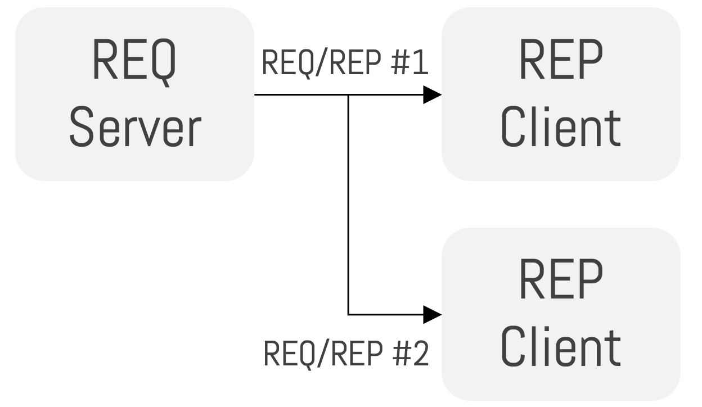
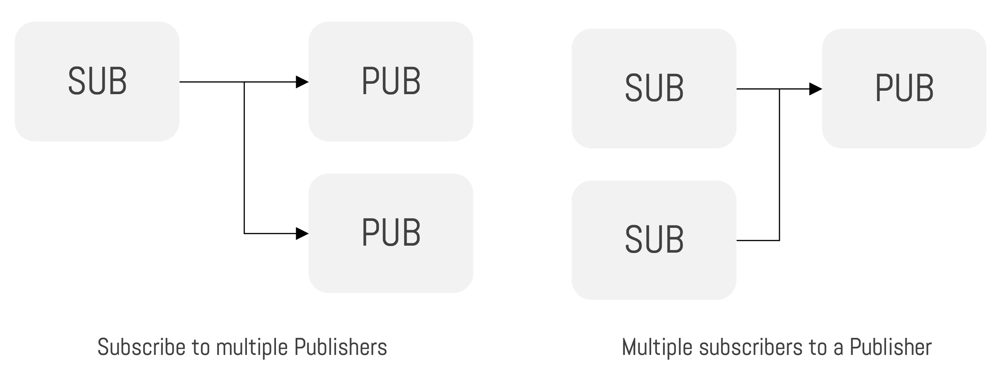
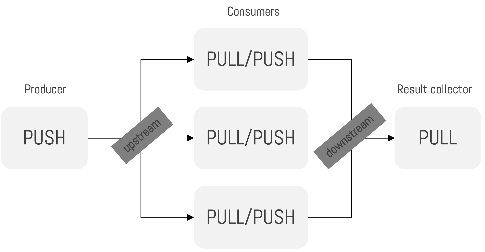

#  Distributed Systems Communication with ZeroMQ

## Learning Goals

This lab focuses on the development and demonstration of different communication patterns between distributed system components, using Python and ZeroMQ on a Google Cloud VM.

ZeroMQ is a messaging library aimed for use in distributed systems, using *sockets* for communications. A socket is an abstract handle for a communication endpoint, represented by an IP address or host name and a communication port number (e.g. `127.0.0.1:5555` or `localhost:5555`). A server application listens to a socket for connection requests from client applications and client applications use sockets to transmit messages to servers and receive responses from them. In addition to an IP address or hostname, and a port number, communication via sockets depend on the utilisation of an established communication protocol, such as TCP.

Using sockets, and the ability to listen, connect, and transmit messages via them, we can establish one-to-one, one-to-many, and many-to-many communication patterns between components of a distributed system (which may or may not reside on the same device).

## Communication Patterns Demonstrated in this Lab
### Overview

In this lab, four different communication patterns between distributed system components will be demonstrated. These are summarised below.

### Exclusive Pair

<div style="text-align: center"></div>

With this pattern, an exclusive one-to-one communication is established between two peers. Once a communication pair have been established, any further connection requests are ignored.

With ZeroMQ, a socket of type `PAIR` is used to implement this pattern.

### Request/Reply

<div style="text-align: center"></div>

With this pattern, one-to-many communication is established between a server and its clients. A client connects to a server and sends its requests to it. For each request received, the server services the request and provides a reply. This is different to a more general client/server type of connection pattern because each request must be followed by a reply, like a call to a function or procedure in programming. Therefore, it forms a remote procedure call and task distribution pattern, often seen in service-oriented architectures.

With ZeroMQ, socket types `REQ` and `REP` are used for components that request and components that reply, respectively.

### Publish/Subscribe

<div style="text-align: center"></div>

With this pattern, one-to-many communication is established between a publisher of data and its data subscribers. Messages associated with specific topics are published by the publishers, without the requirement or the knowledge of clients that consume them. One or more clients can subscribe to their topics of interest, on the publishers of interest, and will then receive the messages posted to those topics, as the messages become available.

With ZeroMQ, socket types `PUB` (or `PUBX`) and `SUB` (or `SUBX`) are used for components that publish and components that subscribe, respectively.

### Push/Pull

<div style="text-align: center"></div>

Referred to as the *pipeline pattern* by ZeroMQ, with this pattern, unidirectional data channels/pipes are established such that tasks can be pushed to system components that act as workers. Workers can then push the output of their actions on the tasks to other workers, and so on, with the final workers in the pipeline pushing their outputs to components acting as collectors.

With ZeroMQ, socket type `PUSH` and `PULL` are used for components that push data and components that pull data, respectively.


## Further Reading

For further information and for information on other communication patterns supported by ZeroMQ, please refer to the ZeroMQ socket API documentation at https://zeromq.org/socket-api/.

## :rotating_light: Important Note :rotating_light:

Working with Sockets can be tricky. Once a socket is allocated/bound to a particular port, for a particular purpose, the port cannot be simultaneously used for another purpose. When running your code, if you do not explicitly destroy the connection context and close the sockets in use, or if you do not stop a running program that has established a socket connection, the port associated with the socket is unlikely to be released. If you subsequently run another program that attempts to establish a socket on the same port, this may fail and crash the program or your program may appear to run but will not exhibit the expected behaviour. For example, its clients may fail to establish a connection to it.

The most appropriate way to address this is to destroy the ZeroMQ context and close the socket, in your code, before your program closes, as shown in the provided code in the sections below.

If you have lost track of what programs you may still have running that have bound themselves to a port that you need released, you can automatically close programs using your port of interest via the Linux `fuser` command. The following demonstrates how you can use this command to identify and close (with the `-k` or `--kill` option) any process that is currently using port `5555` with the TCP protocol.

```bash
sudo fuser -k 5555/tcp
```

## Lab Activities


### Preparing the VM

1. Create and run a new VM running the Ubuntu operating system on Google Cloud, as you have done in previous labs.

2. Open a new SSH terminal connection to your VM and run the following commands to install the necessary development tools.

    ```bash
    sudo apt update
    sudo apt install psmisc -y
    sudo apt install software-properties-common -y
    sudo apt install python3 -y
    sudo apt install python3-pip -y
    pip3 install pyzmq --break-system-packages
    ```
    
    > :warning: Note that option `--break-system-packages` used with `pip3` causes the ZeroMQ Python package (`pyzmq`) to be installed system-wide. Usually, this would not be a good idea, as it could impact/break other Python programs used on the system. It is usually best to create Python virtual environments under which the relevant packages are installed and to then activate and use these virtual environments as required. However, as we will not be hosting any Python applications on the VM and will be destroying the VM at the end of the lab, there is no risk in installing Python packages on a system-wide basis.
    
    
3. Check that you have `nano` installed by running the following command.

    ```bash
    nano --version
    ```
    
4. If you do not have `nano` installed, install it by running the following command.

    ```bash
    sudo apt install nano
    ```
    
    > :information_source: Note that, alternatively, you may choose to use your personal machine for code editing and push your code to a GitHub repository, which you can then clone and pull onto the VM. Instructions below will assume that you will carry out your development activities on the VM itself.

---

### Implementing the Exclusive Pair Pattern

#### Overview

For this demonstration, we will produce a server and a client that can pair up, in an exclusive fashion, to exchange messages between each other.

#### Defining the Server

1. Create a file named `pair-server.py` and open it for editing by running the following command.

    ```bash
    nano pair-server.py
    ```
2. Enter the following code. Note that the special `localhost` machine name has been specified in the code, as all system components will run on the same VM.

    ```python
    # Import required modules
    import zmq
    import time
    
    # Initialise a new ZeroMQ context for creating a socket
    context = zmq.Context()
    
    # Create a PAIR-type socket
    socket = context.socket(zmq.PAIR)
    
    # Ensure that any pending messages are discarded when the socket is closed
    socket.setsockopt(zmq.LINGER, 0)
    
    # Create a server connection on port 5555 of the machine on which the code is running
    socket.bind("tcp://localhost:5555")
    
    # While the program is running:
    while True:
        
        # Send a message to the connected client (if any)
        socket.send_string("Server message to Client")
        
        # Await a message from the connected client and print it when received
        message = socket.recv()
        print(message)
        
        # Pause for one second
        time.sleep(1)
    ```
    
3. Save and close the file by applying the `Ctrl+S` and then the `Ctrl+X` keyboard key combination.

#### Defining the Client

4. Create a file named `pair-client.py` and open it for editing by running the following command.

    ```bash
    nano pair-client.py
    ```
    
5. Enter the following code. Note that the special `localhost` machine name has been specified in the code, as all system components will run on the same VM.

    ```python
    # Import required modules
    import zmq
    import time
    
    # Initialise a new ZeroMQ context for creating a socket
    context = zmq.Context()
    
    # Create a PAIR-type socket
    socket = context.socket(zmq.PAIR)
    
    # Ensure that any pending messages are discarded when the socket is closed
    socket.setsockopt(zmq.LINGER, 0)
    
    # Create a client connection on port 5555 of the machine on which the code is running
    # Note the call to socket.connect, rather than socket.bind
    socket.connect("tcp://localhost:5555")
    
    # For up to 10 messages:
    for _ in range(10):
        
        # Await a message from the server and print it when received
        message = socket.recv()
        print(message)
        
        # Send two messages to the server
        socket.send_string("Hello from Client")
        socket.send_string("This is a client message to the server")
        
        # Pause for one second
        time.sleep(1)
        
    # Destroy the context and close the socket, to clean up, before finishing
    context.destroy()
    socket.close()
    ```
    
6. Save and close the file by applying the `Ctrl+S` and then the `Ctrl+X` keyboard key combination.
    
#### Running the Server

7. On your active SSH terminal window (or on a new window, if one is not already open), start the server by running the following command.

    ```bash
    python3 pair-server.py
    ```

#### Running the Client

8. On a separate SSH terminal window, start the client by running the following command.

    ```bash
    python3 pair-client.py
    ```

9. Examine the outputs generated by the client and the server to verify their operation.

    > :information_source: Notes
    > - We can run only one exclusive pair at a time. After the client has successfully connected to the server, attempting to run another instance of the client will cause the second instance to hang. `PAIR`-type sockets are, therefore, ideal when a client needs to have exclusive access to a server.
    > - Due to the exclusivity of the pair, even after the initial client has shut down, starting the client again will cause the client program to hang.
    > - We can have multiple PAIR client and server connections, but each pair will have to use a different port number.

#### Cleaning Up

10. After 10 repetitions of its actions, the client program will automatically end. However, as the server contains no such logic, we will have to stop it manually. To do so, on the SSH terminal running the server, apply the `Ctrl+C` keyboard key combination.

11. As the server process was closed manually and it did not release the socket to which it was bound, run the following command to ensure that the socket has been released.

    ```bash
    sudo fuser -k 5555/tcp
    ```
    
12. Close your SSH terminal windows by running the following command in each.

    ```bash
    exit
    ```

---


### Implementing the Request/Reply Pattern

#### Overview

For this demonstration, we will produce a server that represents a data service and two separate clients that obtain data from that service.

#### Defining the Server/Replier

1. On an active SSH terminal window (or on a new window, if one is not already open), create a file named `rep-server.py` and open it for editing by running the following command.

    ```bash
    nano rep-server.py
    ```
    
2. Enter the following code. Note that the special `localhost` machine name has been specified in the code, as all system components will run on the same VM.

    ```python
    # Import required modules
    import zmq
    import time
    
    # Initialise a new ZeroMQ context for creating a socket
    context = zmq.Context()
    
    # Create a REP-type socket
    socket = context.socket(zmq.REP)
    
    # Ensure that any pending messages are discarded when the socket is closed
    socket.setsockopt(zmq.LINGER, 0)
    
    # Create a server connection on port 5555 of the machine on which the code is running
    socket.bind("tcp://localhost:5555")
    
    # While no errors (such as a keyboard interrupt) occur:
    try:
    
        # Constantly:
        while True:
            
            # Await a message from a requester and print it when received
            message = socket.recv().decode("utf-8")
            print(f"Received request: {message}")
            
            # Pause for one second
            time.sleep(1)
            
            # Reply to the requester with a message
            socket.send_string("Hi from Server")
    
    # Destroy the context and close the socket, to clean up, upon any errors
    except KeyboardInterrupt:
        context.destroy()
        socket.close()
    ```

3. Save and close the file by applying the `Ctrl+S` and then the `Ctrl+X` keyboard key combination.

#### Defining the First Client/Requester

4. Create a file named `req-client1.py` and open it for editing by running the following command.

    ```bash
    nano req-client1.py
    ```
    
5. Enter the following code. Note that the special `localhost` machine name has been specified in the code, as all system components will run on the same VM.

    ```python
    # Import required modules
    import zmq
    import time
    
    # Note the client ID
    CLIENT_ID = 1
    
    # Initialise a new ZeroMQ context for creating a socket
    context = zmq.Context()
    
    # Create a REQ-type socket
    socket = context.socket(zmq.REQ)
    
    # Ensure that any pending messages are discarded when the socket is closed
    socket.setsockopt(zmq.LINGER, 0)
    
    # Create a client connection on port 5555 of the machine on which the code is running
    # Note the call to socket.connect, rather than socket.bind
    socket.connect("tcp://localhost:5555")
    
    # For up to 10 requests:
    for i in range(1, 11):
        
        # Send a request to the server
        print(f"Sending request {i} from client {CLIENT_ID}")
        socket.send_string(f"Hello from client {CLIENT_ID}")
        
        # Await a response from the server and print it when received
        message = socket.recv().decode("utf-8")
        print(f"Received reply '{message}' to request {i} from client {CLIENT_ID}")
        
        # Pause for one second
        time.sleep(1)
        
    # Destroy the context and close the socket, to clean up, before finishing
    context.destroy()
    socket.close()
    ```
    
6. Save and close the file by applying the `Ctrl+S` and then the `Ctrl+X` keyboard key combination.

#### Defining the Second Client/Requester

7. Create a copy of the first client's code, named `req-client2.py`, by running the following command.

    ```bash
    cp req-client1.py req-client2.py
    ```
    
8. Assign `2` to the internal `CLIENT_ID` of the copy by running the following command. This will substitute any instances of `CLIENT_ID = 1` with `CLIENT_ID = 2`. Alternatively, you could edit the file (e.g. via `nano`) to make the change and then save it.

    ```bash
    sed -i 's/CLIENT_ID = 1/CLIENT_ID = 2/g' req-client2.py
    ```
    
9. Check that the `CLIENT_ID` value has been correctly updated by viewing the filtered file contents, for the line where the client ID is assigned, by running the following command.

    ```bash
    cat req-client2.py | grep 'CLIENT_ID ='
    ```

#### Running the Server/Replier

10. On your active SSH terminal window (or on a new window), start the server by running the following command.

    ```bash
    python3 rep-server.py
    ```

#### Running the First Client/Requester

11. On a separate SSH terminal window, start the first client by running the following command.

    ```bash
    python3 req-client1.py
    ```

#### Running the Second Client/Requester

12. On yet another SSH terminal window, start the second client by running the following command.

    ```bash
    python3 req-client2.py
    ```

13. Examine the outputs generated by the client and the server instances to verify their operation.

    > :information_source: Notes
    > - The pattern demonstrated here is very similar to that of lab 1. Clients make calls to a target service, and the service replies with the relevant data.
    > - Unlike the exclusive pair pattern, with this pattern, you can start a client instance that has run and closed and it will successfully communicate with the server again.

#### Cleaning Up

14. After 10 repetitions of its actions, each client program will automatically end. However, as the server contains no such logic, we will have to stop it manually. To do so, on the SSH terminal running the server, apply the `Ctrl+C` keyboard key combination.

15. As the server process should have released the socket to which it was bound, no further action with this regard should be necessary. However, if you wish, you can run the following command to ensure that the socket has been released.

    ```bash
    sudo fuser -k 5555/tcp
    ```   
16. Close your SSH terminal windows by running the following command in each.

    ```bash
    exit
    ```

---


### Implementing the Publish/Subscribe Pattern

#### Overview

For this demonstration, we will produce a server that publishes temperature readings for a number of different ZIP codes and a client that subscribes to published temperature readings concerning only one of these ZIP codes and obtains the readings as they arrive and calculates a running average of the readings that it has obtained so far.

We will run two instances of the server and one instance of the client, which will connect to both servers, demonstrating the possibility for a client to consume messages from more than one publisher.

#### Defining the Server/Publisher

1. On an active SSH terminal window (or on a new window, if one is not already open), create a file named `pub_server.py` and open it for editing by running the following command.

    ```bash
    nano pub_server.py
    ```
    
2. Enter the following code. Note that the special `localhost` machine name has been specified in the code, as all system components will run on the same VM, but the port number is read from the command line. This capability will be used later to run two separate instances of the publisher, with each bound to a different port number.

    ```python
    # Import required modules
    import zmq
    import random
    import sys
    import time
    
    # Obtain the port number from the command line arguments passed to the program
    port_number = int(sys.argv[1])
    
    # Initialise a new ZeroMQ context for creating a socket
    context = zmq.Context()
    
    # Create a PUB-type socket
    socket = context.socket(zmq.PUB)
    
    # Create a server connection on the required port of the machine on which the code is running
    socket.bind(f"tcp://localhost:{port_number}")
    
    # While no errors (such as a keyboard interrupt) occur:
    try:
    
        # Constantly:
        while True:
            
            # Pick a random topic to post messages to
            topic = random.randrange(9999, 10005)
            
            # Generate a random temperature reading as a message for the topic
            message = random.randrange(-80, 135)
            
            # Print the generated topic and message combination
            print(f"Topic: {topic}, Message: {message}, Port Number: {port_number}")
            
            # Publish the generated message to the generated topic
            # This is done by preceding the message with the topic and a space
            socket.send_string(f"{topic} {message} {port_number}")
            
            # Pause for one second
            time.sleep(1)
    
    # Destroy the context and close the socket, to clean up, upon any errors
    except KeyboardInterrupt:
        context.destroy()
        socket.close()
    ```

3. Save and close the file by applying the `Ctrl+S` and then the `Ctrl+X` keyboard key combination.

    > :information_source: The publisher represents the model of a temperature sensor service that, once every second, publishes the latest temperature reading for a different ZIP code area, where the ZIP code is the topic of the published message. Clients can subscribe to the feed and, if required, extract only messages associated with a topic (i.e. ZIP code) of their interest.


#### Defining the Client/Subscriber

4. Create a file named `pub_client.py` and open it for editing by running the following command.

    ```bash
    nano pub_client.py
    ```
    
5. Enter the following code. Note that the special `localhost` machine name has been specified in the code, as all system components will run on the same VM, but the port numbers for publishers are read from the command line. This capability will be used later to connect to the two separate instances of the publisher.

    ```python
    # Import required modules
    import zmq
    import sys
    
    # Obtain a list of publisher port numbers from the command line arguments passed to the program
    publisher_port_numbers = [int(port_number) for port_number in sys.argv[1:]]
    
    # Initialise a new ZeroMQ context for creating sockets
    context = zmq.Context()
    
    # Create a SUB-type socket
    socket = context.socket(zmq.SUB)
    
    # Create a client connection for each given port number of the machine on which the code is running
    # Note the call to socket.connect, rather than socket.bind
    for port_number in publisher_port_numbers:
        socket.connect(f"tcp://localhost:{port_number}")
    
    # Subscribe only to topic 10001
    socket.setsockopt_string(zmq.SUBSCRIBE, "10001")
    
    # Assume an initial running mean temperature value of zero
    running_mean = 0.0
    
    # For up to 10 received publications on the topic:
    for i in range(1, 11):
        
        # Await a publication from the server and split it into topic, message, and port portions
        data = socket.recv().decode("utf-8")
        topic, message, port = data.split()
        
        # Print the received portions
        print(f"Topic: {topic}, Message: {message}, Port: {port}")
        
        # Calculate and print the running mean temperate value extracted from the message
        running_mean = (running_mean * (i - 1) + float(message)) / i
        print(f"  Running average of message values for {topic}, over {i} message(s): {running_mean}")
        
    # Destroy the context and close the socket, to clean up, before finishing
    context.destroy()
    socket.close()
    ```

6. Save and close the file by applying the `Ctrl+S` and then the `Ctrl+X` keyboard key combination.

    > :information_source: The subscriber can subscribe to one or more separate temperature sensor services, ZIP code 10001 only. It receives a maximum of 10 messages on this topic and calculates an updated running average of temperature readings for this ZIP code.

#### Running the First Server/Publisher

7. On your active SSH terminal window (or on a new window), start one instance of the server, bound to port `5555`, by running the following command.

    ```bash
    python3 pub_server.py 5555
    ```

#### Running the Second Server/Publisher

8. On a separate SSH terminal window, start a second instance of the server, bound to port `5556`, by running the following command.

    ```bash
    python3 pub_server.py 5556
    ```

#### Running the Client/Subscriber

9. On yet another SSH terminal window, start the client and make it connect to each of the running servers by running the following command.

    ```bash
    python3 pub_client.py 5555 5556
    ```

10. Examine the outputs generated by the client and the server instances to verify their operation.

    > :information_source: Notes
    > - The server instances publish different temperature readings for different ZIP code areas. Although the client connects to both servers, it filters out the publications for only the 10001 ZIP code, regardless of what server published the information.
    > - Unlike the exclusive pair pattern, with this pattern, you can start a client instance that has run and closed and it will successfully communicate with the servers again.

#### Cleaning Up

11. After 10 processed published messages, the client program will automatically end. However, as the server contains no such logic, we will have to stop each manually. To do so, on the relevant SSH terminal running an instance of the server, apply the `Ctrl+C` keyboard key combination.

12. As each server process should have released the socket to which it was bound, no further action with this regard should be necessary. However, if you wish, you can run the following commands to ensure that the sockets have been released.

    ```bash
    sudo fuser -k 5555/tcp
    sudo fuser -k 5556/tcp
    ```   
13. Close your SSH terminal windows by running the following command in each.

    ```bash
    exit
    ```

---


### Implementing the Push/Pull Pattern

#### Overview

For this demonstration, we will produce a server that produces and pushes numbers between 0 and 9, in a round-robin fashion, to consumers connected to it, a consumer that will pull these values, process them, and push them onto a final collector client, and a collector that pulls the processed values from consumers.

We will run one instance of the producer, two instances of consumer, and one instance of the collector, demonstrating the possibility for a client to consume the outputs of separate workers (represented as the consumer instances) that are given tasks by a source producer.


#### Defining the Server/Producer

1. On an active SSH terminal window (or on a new window, if one is not already open), create a file named `producer.py` and open it for editing by running the following command.

    ```bash
    nano producer.py
    ```
    
2. Enter the following code. Note that the special `localhost` machine name has been specified in the code, as all system components will run on the same VM.

    ```python
    # Import required modules
    import zmq
    import random
    import time
        
    # Initialise a new ZeroMQ context for creating a socket
    context = zmq.Context()
    
    # Create a PUSH-type socket
    socket = context.socket(zmq.PUSH)
    
    # Create a server connection on port 5555 of the machine on which the code is running
    socket.bind("tcp://localhost:5555")
    
    # Assume an initial sum of 0 for numbers that will be dispatched
    running_total = 0
    
    # For up to 10 pushes:
    for _ in range(10):
        
        # Generate a random value between 1 and 5
        value = random.randint(1, 5)
        
        # Embed the value in a dictionary, print it, and transmit it as a JSON object
        message = {"number": value}
        print(f"Dispatching {message}")
        socket.send_json(message)
        
        # Update the running total of values dispatched so far
        running_total += value
        
        # Pause for one second
        time.sleep(1)
    
    # Print out the expected final total that should be output by the final collector
    print(f"Expected final total: {running_total}")
    
    # Destroy the context and close the socket, to clean up, upon any errors
    context.destroy()
    socket.close()
    ```

3. Save and close the file by applying the `Ctrl+S` and then the `Ctrl+X` keyboard key combination.

    > :information_source: The producer represents a task dispatcher, which will push tasks onto one or more task consumers connected to it, in a round-robin fashion. In this case, the tasks are numbers that the consumers should add together before pushing them onto a final collector.

#### Defining the Consumer

4. Create a file named `consumer.py` and open it for editing by running the following command.

    ```bash
    nano consumer.py
    ```
    
5. Enter the following code. Note that the special `localhost` machine name has been specified in the code, as all system components will run on the same VM.

    ```python
    # Import required modules
    import zmq
    import random
    import time
    
    # Generate a random number to use as the unique ID of the consumer and print this
    consumer_id = random.randrange(1, 10005)
    print(f"My Consumer ID: {consumer_id}")
        
    # Initialise a new ZeroMQ context for creating a socket
    context = zmq.Context()
    
    # Create a PULL-type socket for obtaining data from the producer
    pull_socket = context.socket(zmq.PULL)
    
    # Create a pull client connection on port 5555 of the machine on which the code is running
    # Note the call to socket.connect, rather than socket.bind
    pull_socket.connect("tcp://localhost:5555")
    
    # Create a PUSH-type socket for pushing data to the collector
    push_socket = context.socket(zmq.PUSH)
    
    # Create a push client connection on port 5556 of the machine on which the code is running
    # Note the call to socket.connect, rather than socket.bind
    push_socket.connect("tcp://localhost:5556")
    
    # Assume an initial sum of 0 for numbers that will be received
    running_total = 0
    
    # While no errors (such as a keyboard interrupt) occur:
    try:
    
        # Constantly:
        while True:
            
            # Await and pull a newly pushed value task from the producer
            task = pull_socket.recv_json()
            
            # Obtain the value embedded in the task and print it
            value = task["number"]
            print(f"Processing {value} received from producer.")
            
            # Pause for a while to pretend as if a CPU-heavy action is being carried out on the value
            # Note that this would usually be a useful processing action instead
            time.sleep(1)
            
            # Embed the number in a dictionary, print it, and transmit it as a JSON object via the PUSH socket
            message = {"from": consumer_id, "number": value}
            print(f"Dispatching {message}")
            push_socket.send_json(message)
    
    # Destroy the context and close the socket, to clean up, upon any errors
    except KeyboardInterrupt:
        context.destroy()
        pull_socket.close()
        push_socket.close()
    ```

6. Save and close the file by applying the `Ctrl+S` and then the `Ctrl+X` keyboard key combination.

    > :information_source: The consumer represents a task executor, which will received tasks given to it, carry them out, and push each result onto the next consumer or collector in line, in a round-robin fashion. In this case, the tasks are numbers that the consumers simply pass on. Normally, however, a consumer would perform a more complex action on the received task (e.g. carry out a CPU-heavy calculation).

#### Defining the Client/Collector

7. create a file named `collector.py` and open it for editing by running the following command.

    ```bash
    nano collector.py
    ```
    
8. Enter the following code. Note that the special `localhost` machine name has been specified in the code, as all system components will run on the same VM.

    ```python
    # Import required modules
    import zmq
        
    # Initialise a new ZeroMQ context for creating a socket
    context = zmq.Context()
    
    # Create a PULL-type socket
    socket = context.socket(zmq.PULL)
    
    # Create a server connection on port 5556 of the machine on which the code is running
    # Note the call to socket.bind, rather than socket.connect
    socket.bind("tcp://localhost:5556")
    
    # Assume an initial sum of 0 for numbers that will be received
    running_total = 0
    
    # For up to 10 pulls:
    for _ in range(10):
    
        # Await and pull a newly pushed output from a consumer
        consumer_output = socket.recv_json()
        
        # Obtain the ID of the consumer and the value embedded in the output and print them
        consumer_id = consumer_output["from"]
        value = consumer_output["number"]
        print(f"Received {value} from consumer {consumer_id}.")
        
        # Update and print the running total of values received so far
        running_total += value
        print(f"Total so far: {running_total}")
    
    # Print out the final running total of received values
    print(f"Final total: {running_total}")
    
    # Destroy the context and close the socket, to clean up, upon any errors
    context.destroy()
    socket.close()
    ```

9. Save and close the file by applying the `Ctrl+S` and then the `Ctrl+X` keyboard key combination.

    > :information_source: The collector represents a server at the end of the push/pull pipeline that receives pushed messages from one or more task consumers connected to it. It then carries out further final processing actions on the received data.
    > 
    > In this case, the collector calculates the sum of the first ten values that it receives, before exiting. As the producer at the start of the pipeline also only produces ten values before exiting, the running final total of values output by the producer and the collector should match.

#### Running the Client/Collector

10. On your active SSH terminal window (or on a new window), start the collector, by running the following command.

    ```bash
    python3 collector.py
    ```

#### Running the First Consumer

11. On a separate SSH terminal window, start an instance of the consumer, by running the following command.

    ```bash
    python3 consumer.py
    ```

#### Running the Second Consumer

12. On yet another SSH terminal window, start a second instance of the consumer, by running the following command.

    ```bash
    python3 consumer.py
    ```

#### Running the Server/Producer

13. On yet another SSH terminal window, start an instance of the producer, by running the following command.

    ```bash
    python3 producer.py
    ```
    
14. Examine the outputs generated by the producer, consumers, and the collector instances to verify their operation.

    > :information_source: Notes
    > - The producer pushes 10 objects holding a random number each.
    > - The objects pushed by the producer and pulled by the consumers in a round-robin fashion, before being repackaged and pushed to the collector.
    > - The objects pushed by the consumers are pulled by the collector, which calculates a running total of the values held by them.
    > - The final total output by the collector should match that expected, as per what the producer reported before closing.

#### Cleaning Up

15. After 10 processed published messages, the producer and collector programs will automatically end. However, as the consumer holds no such logic, we will have to stop each manually. To do so, on the relevant SSH terminal running an instance of the consumer, apply the `Ctrl+C` keyboard key combination.

16. As each process should have released the socket to which it was bound, no further action with this regard should be necessary. However, if you wish, you can run the following commands to ensure that the sockets have been released.

    ```bash
    sudo fuser -k 5555/tcp
    sudo fuser -k 5556/tcp
    ```   
13. Close your SSH terminal windows by running the following command in each.

    ```bash
    exit
    ```

---

### Deleting the VM

:warning: Once you have completed the lab activities above and any additional experimentation of your own, ensure that you delete the VM used during the lab to stop being charged for it.


## Further Reading

For further information and for information on other communication patterns supported by ZeroMQ, please refer to the ZeroMQ socket API documentation at https://zeromq.org/socket-api/.

The full ZeroMQ API documentation for Python can be found at https://pyzmq.readthedocs.io/en/latest/api/index.html.
